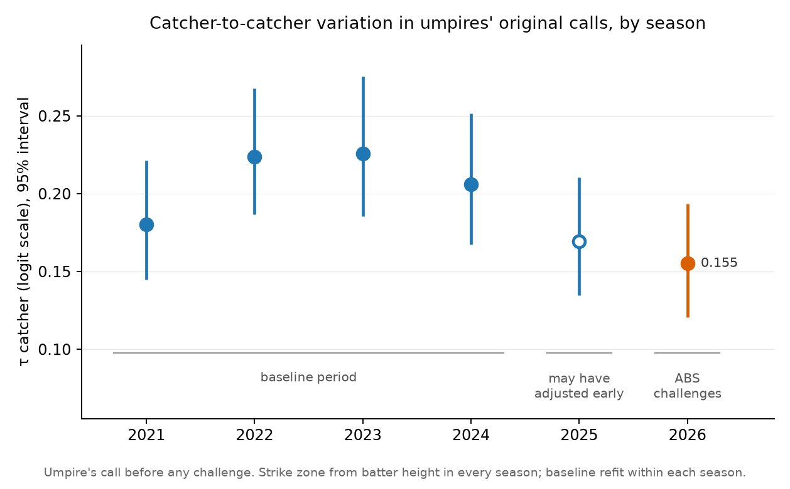

# Postscript: framing in the ABS era

**English** | [繁體中文](ABS.zh-TW.md)

In 2026 the automated ball-strike (ABS) challenge system went live in the regular season. A batter, pitcher or catcher can ask for a called pitch to be checked against the tracked zone, and the call is overturned if the tracking disagrees. This document asks whether umpires' calls still respond to who is catching once that is possible. It is a separate analysis from v2, done after v2 was finished. The v2 pipeline, caches and published numbers are unchanged, and because the design below differs from v2's, the same season can carry a different τ here than in the [README](README.md).

The design was written down before any 2026 model was fit. Section 4 reports the result: 2026 has the lowest posterior mean catcher variation of the six seasons, but does not meet the prespecified threshold for being lower than every baseline season. The decline began before ABS.

---

## 1. Three questions, one answered here

| | Question | Calls used |
|---|---|---|
| **Q1** | Do umpires' calls still vary with the catcher? | The umpire's **original** call |
| Q2 | How much framing value survives the challenges? | Final call against original call |
| Q3 | Is challenging a new catcher skill, and does it go with framing? | Challenge records |

This round answers Q1 only. Overturning a stolen strike removes that particular positive call, while overturning a ball can add a strike. The net value after both types of review therefore requires Q2’s analysis; it is not guaranteed to decrease. Q3 is descriptive.

## 2. Data

### 2.1 Statcast records the final call

The 2026 regular season ran from March 25 to September 27: 2,429 games and 356,498 called pitches. In 2026, Statcast's `description` is the call **after** any challenge. A pitch a batter successfully challenged is recorded as `ball`; one a catcher successfully challenged, as `called_strike`. No field marks either. Framing is about the umpire's call, so the original has to be recovered from elsewhere.

The MLB Stats API's `playByPlay` feed carries `reviewDetails` on every challenged pitch: the review type, whether it was overturned, and who challenged. ABS challenges are review type `MJ` on called pitches; the other review types are ordinary replay reviews and never touch a ball-strike call. The feed also shows the final call, so the original is the final call flipped wherever the challenge succeeded ([`data/challenges.py`](data/challenges.py)).

| | |
|---|--:|
| ABS challenges | 7,896 |
| overturned | 4,431 (56%) |
| on pitches outside the called-pitch sample (3 `automatic_ball`, 1 `automatic_strike`, 1 recorded as a foul) | 5 |
| matched to a called pitch | 7,891 |
| of those, final call agrees between the feed and Statcast | 7,891 (100%) |

Catchers made 4,292 of the matched challenges (55% overturned), batters 3,466 (58%) and pitchers 133 (40%). Of the 4,016 team-games with a challenge, 4,006 had at most two that failed and 10 had three. Recovering the originals moves the season's called-strike rate from 32.44% (final) to 32.32% (original): successful catcher challenges slightly outnumber successful batter ones.

The pipeline refuses to build the 2026 season without complete challenge records, and it stops if any challenge fails to match a called pitch without an explanation or disagrees with Statcast on the final call. Six tests guard the reconstruction ([`tests/test_challenges.py`](tests/test_challenges.py)).

### 2.2 One strike zone for every season

From 2026, Statcast's `sz_top` and `sz_bot` are fixed fractions of the batter's height, 53.5% and 27%: the ABS zone. The ratio is identical on every row, and from April to June, the months checked, a batter's value moved by no more than 0.0005 ft. Before 2026 they were measured pitch by pitch from the batter's stance. A standardized height built from one is not comparable with one built from the other, and 2026 no longer has the stance version, so every season is converted to the height-based zone ([`data/heights.py`](data/heights.py)).

Heights come from 2026's `sz_top / 0.535` for the 662 batters who appeared in 2026, and from the Stats API's listed height for the other 986. For 300 of the measured batters checked against their listed height, the two differ by 0.02 inches on average and by at most half an inch. The ABS zone's top edge sits lower than the stance zone's: about 3.22 ft on average in 2023 and 2025, against 3.36 and 3.44 for the stance version.

One thing not checked: at what depth over the plate `plate_z` is measured, against the ABS zone's reference plane.

## 3. Design

Everything in this section was fixed before any 2026 model was fit. At that point I had looked at one day of 2026 challenge counts and no estimates.

- **Calls**: the umpire's original call in 2026. Other seasons have no challenges.
- **Zone**: the height-based ABS zone in every season.
- **Baseline**: the same functional form as v2, but five-fold game-level cross-fitting within each season. The fixed v2 baseline overpredicts 2025’s overall strike rate by 2.6 percentage points (README §7), so the comparison uses season-specific fits. Predicted and observed overall strike rates differ by less than 0.002 percentage points ([`results/abs/baseline_check.csv`](results/abs/baseline_check.csv)); this checks the mean, not calibration at every location or for every catcher.
- **Shadow zone**: 0.2 < p̂ < 0.8 under each season's own baseline.
- **Hierarchical model**: the same as v2, NUTS with 4 chains × 1,000 warm-up + 1,000 draws, one fit per season ([`models/abs_era.py`](models/abs_era.py)).
- **Baseline period**: 2021–2024. 2025 is reported but kept out of the decision, because ABS was tested in spring training that year and the called zone narrowed during it (README §7), so umpires may already have been adjusting.

**Decision rule.** For each baseline season *s*, compute P(τ_2026 < τ_s) from the product of the independently fitted marginal posteriors. Use all cross-season draw combinations, not matching draw indices, which can retain dependence from reused sampler seeds.

- All four above 0.95: meets the prespecified threshold for being lower than every baseline season.
- All four below 0.05: meets the prespecified threshold for being higher than every baseline season.
- Otherwise: does not meet the prespecified threshold for a change relative to every baseline season.

Report τ_2026 / τ_s and its interval in every case. The four marginal thresholds are the original decision rule, not a 95% joint posterior criterion. The joint probability of being lower than all four is reported separately. A one-sided probability threshold of 0.95 is also different from excluding 1 in a two-sided 95% ratio interval.

The expectation recorded in advance was that τ_2026 would be lower than the baseline period without meeting this rule. The motivation was that few calls per game can be challenged and τ had already been falling since 2023. Those were hypotheses about behavior, not conclusions established by the design.

(A note: a background job meant to wait for the 2021–2025 fits was triggered by a progress line and ran the report while 2025 was still fitting, so 2026 against 2021–2024 was seen after the design was fixed but before every season had finished. Nothing in the design or the rule changed as a result.)

## 4. Results

All eleven primary fits (six seasons on the ABS zone, five on the stance zone) returned zero divergences. Maximum R-hat was 1.002–1.007 in 2021–2025 and 1.018 in 2026. The existing fits were retained; these diagnostics alone do not establish complete convergence, and the higher 2026 value is a computational limitation. More sampling for convergence checks would not change the prespecified model-selection rule.

<p align="center">
  
</p>

| | 2021 | 2022 | 2023 | 2024 | 2025 | **2026** |
|---|--:|--:|--:|--:|--:|--:|
| τ catcher | 0.180 | 0.224 | 0.226 | 0.206 | 0.169 | **0.155** |
| 95% interval | [0.145, 0.221] | [0.187, 0.268] | [0.186, 0.275] | [0.167, 0.251] | [0.135, 0.211] | [0.121, 0.193] |
| shadow-zone pitches | 52,316 | 50,387 | 50,136 | 49,128 | 48,090 | 42,902 |

| 2026 against | P(τ_2026 lower) | τ_2026 / τ_s, median [95%] |
|---|--:|---|
| 2021 | 0.821 | 0.86 [0.62, 1.18] |
| 2022 | 0.994 | 0.69 [0.51, 0.92] |
| 2023 | 0.993 | 0.69 [0.50, 0.93] |
| 2024 | 0.966 | 0.75 [0.55, 1.02] |
| 2025 (outside the rule) | 0.701 | 0.92 [0.66, 1.26] |

**The prespecified threshold for a change relative to every baseline season is not met.** Three marginal comparisons exceed 0.95; 2021 does not. The joint probability that 2026 is lower than all four is 0.805 ([`results/abs/q1_comparison.csv`](results/abs/q1_comparison.csv)). This does not establish no change or equivalence. τ’s posterior mean falls from 0.226 in 2023 to 0.155 in 2026, but the decline predates ABS (0.206 in 2024, 0.169 in 2025); the 2025 comparison is inconclusive (probability of a decrease 0.701). These probabilities and ratio intervals replace earlier matching-index calculations that overstated evidence and narrowed intervals.

For persistence, the correlation between a catcher's effect in consecutive seasons (catchers with ≥300 shadow-zone pitches in both) is:

| 2021→22 | 2022→23 | 2023→24 | 2024→25 | 2025→26 |
|--:|--:|--:|--:|--:|
| 0.66 | 0.65 | 0.64 | 0.57 | **0.40** |

2025→26 is the lowest, as expected, but the drop began a year earlier. Each pair has 43 to 47 catchers, so a correlation of 0.5 carries an interval of roughly ±0.25.

On the stance zone, τ for 2021–2025 is 0.165, 0.204, 0.201, 0.183 and 0.171. That is 0.016–0.025 below the ABS-zone figures in 2021–2024 and about equal in 2025. Posterior means are higher in 2022–2023 and then decline under both definitions, but similar seasons exchange positions. The main comparison consistently uses the ABS coordinate definition; this removes the change of height-standardization definition, not differences in seasonal pitch mix, selected shadow samples or baseline adequacy.

The share of pitches in the **model-defined shadow zone** is smaller: 15.3% in 2021, 14.0% in 2025 and 12.4% in 2026; the 2026 count is 10.8% below 2025’s. This is the share whose season-specific fitted baseline falls between 0.2 and 0.8. It depends on pitch composition, the fitted curve and zone selection; it does not directly measure umpire hesitation or establish that umpires became more certain. The τ comparisons likewise refer to each season’s selected sample rather than a common standardized pitch population.

All tables are in [`results/abs/`](results/abs/).

## 5. What this can and cannot say

- **It cannot attribute anything to ABS.** Every team switched at once, so there is no control group, and the decline predates ABS, so this holds whatever the decision rule says. Anything else that changed in 2026, such as umpire turnover or pitch mix, is mixed in.
- **τ does not say which side changed.** It measures how much umpires' calls vary with the catcher. A smaller τ fits umpires responding less to framing, catchers framing less, or catchers becoming more alike, and these data cannot tell them apart.
- **Knowing a call can be challenged is part of what is measured.** If umpires call the zone differently because they may be overruled, that shows up here, and it cannot be separated from anything else that changed that season.
- **Precision.** A single season pins τ to roughly ±20%. A change of a tenth would not be visible.
- **One season.** 2026 is the only ABS season so far.

## 6. Not done yet

Q2, how much value survives the challenges, and Q3, whether challenging is a catcher skill, have not been done. The exploratory check registered in advance, whether umpires respond differently once the batting team has no challenges left, has not been run.

## 7. Reproduce

```bash
# 2026: pitches, challenges, then the season file (refuses to build without challenges)
uv run python -c "from data.fetch import get_or_fetch_month; [get_or_fetch_month(2026, m) for m in range(3, 11)]"
uv run python -m data.challenges 2026
uv run python -m data.fetch --season 2026
uv run python -m data.umpires 2026
uv run python -m data.heights

# one fit per season (~15–25 min each, mostly the cross-fitting), then the report
uv run python -m models.abs_era fit --zone abs
uv run python -m models.abs_era fit --zone stance
uv run python -m models.abs_era report

uv run python -m scripts.make_figures_v2 --only abs_tau
uv run python -m scripts.make_results
```
