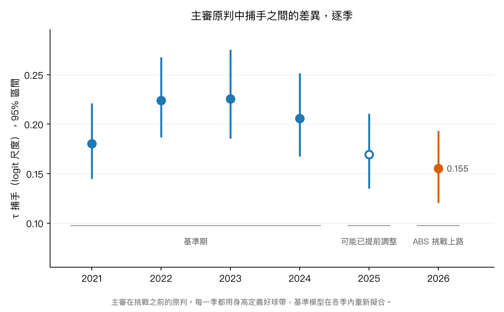

# 後記：ABS 時代的 framing

[English](ABS.md) | **繁體中文**

2026 年，自動好壞球（ABS）挑戰制度在例行賽上路。打者、投手或捕手可以要求把一顆判定球拿去跟追蹤系統的好球帶比對，追蹤結果不同就推翻判決。這份文件要問的是：在判決可以被挑戰之後，主審的判決還會不會隨捕手而不同。這是 v2 完成之後另外做的分析。v2 的流程、快取與已發表的數字都沒有動；也因為下面的設計和 v2 不同，同一季在這裡的 τ 可能和 [README](README.zh-TW.md) 裡的不一樣。

設計在擬合任何 2026 模型之前就寫定了，下面第 3 節就是那份計畫。簡短的答案在第 4 節：2026 是六季裡捕手差異最小的一季，但照事先定好的規則，這個變化偵測不到，而且下降早在 ABS 之前就開始了。

---

## 1. 三個問題，這裡回答一個

| | 問題 | 用哪個判決 |
|---|---|---|
| **Q1** | 主審的判決還會不會隨捕手而不同？ | 主審的**原判** |
| Q2 | 挑戰之後，framing 還剩多少價值？ | 最終判決對原判 |
| Q3 | 挑戰是不是捕手的新技能？跟 framing 有沒有關係？ | 挑戰紀錄 |

這一輪只回答 Q1。Q2 有一部分是機制上必然的：被推翻的偷好球只會讓淨值變小。Q3 是描述性的。

## 2. 資料

### 2.1 Statcast 記的是最終判決

2026 例行賽從 3 月 25 日打到 9 月 27 日，共 2,429 場、356,498 顆判定球。2026 的 Statcast `description` 記的是挑戰**之後**的判決：打者挑戰成功的球記成 `ball`，捕手挑戰成功的記成 `called_strike`，沒有任何欄位標記這件事。framing 量的是主審的判決，所以原判得從別處找回來。

MLB Stats API 的 `playByPlay` 在每一顆被挑戰的球上都有 `reviewDetails`：審查類型、是否推翻、誰提出挑戰。ABS 挑戰是落在判定球上的 `MJ` 類型；其他類型是一般的 replay review，不碰好壞球判決。這個資料源給的也是最終判決，所以原判就是把挑戰成功的那些反過來（[`data/challenges.py`](data/challenges.py)）。

| | |
|---|--:|
| ABS 挑戰 | 7,896 |
| 推翻 | 4,431（56%） |
| 落在判定球樣本之外的球上（3 次 `automatic_ball`、1 次 `automatic_strike`、1 次被記成界外） | 5 |
| 對上判定球 | 7,891 |
| 其中兩邊最終判決一致 | 7,891（100%） |

對上的挑戰裡，捕手提出 4,292 次（推翻 55%），打者 3,466 次（58%），投手 133 次（40%）。有挑戰的 4,016 個隊伍場次中，4,006 個最多失敗兩次，10 個失敗了三次。還原原判之後，整季的好球率從 32.44%（最終）變成 32.32%（原判）：捕手挑戰成功的次數略多於打者。

少了完整的挑戰紀錄，流程會拒絕建立 2026 的季檔；只要有挑戰對不上判定球又解釋不了，或最終判決和 Statcast 不一致，也會停下來。還原這一步有六個測試守著（[`tests/test_challenges.py`](tests/test_challenges.py)）。

### 2.2 每一季用同一個好球帶

2026 起，Statcast 的 `sz_top` 和 `sz_bot` 是打者身高的固定比例，53.5% 和 27%，也就是 ABS 的好球帶。每一列的比例都完全相同；在檢查過的 4 到 6 月，同一位打者的值變動不超過 0.0005 英尺。2026 以前，這兩個值是依打擊姿勢逐球量的。用其中一種定義標準化的高度，不能和另一種比；而 2026 已經沒有姿勢版本，所以每一季都換成以身高定義的好球帶（[`data/heights.py`](data/heights.py)）。

身高的來源：2026 有上場的 662 位打者用 2026 的 `sz_top / 0.535`，其餘 986 位用 Stats API 的登錄身高。抽 300 位實測的打者對照登錄身高，兩者平均差 0.02 英寸，最多差半英寸。ABS 好球帶的上緣比姿勢版本低：2023 和 2025 平均約 3.22 英尺，姿勢版本是 3.36 和 3.44。

有一件事沒有確認：`plate_z` 量的是本壘板上哪個深度，和 ABS 好球帶的判定平面是否相同。

## 3. 設計

本節全部在擬合任何 2026 模型之前定案。當時我只看過 2026 一天的挑戰次數，沒看過任何估計值。

- **判決**：2026 用主審原判。其他季沒有挑戰。
- **好球帶**：每一季都用以身高定義的 ABS 好球帶。
- **基準模型**：形式和 v2 相同，但**每一季在自己內部**依 `game_pk` 做五折 cross-fitting。v2 固定用一個 2021–2022 的模型，README §7 顯示它把 2025 的好球率高估了 2.6 個百分點；跨季比較不能帶著這種偏差。逐季的基準模型和各季實際好球率的差距都在 0.002 個百分點以內（[`results/abs/baseline_check.csv`](results/abs/baseline_check.csv)）。
- **shadow zone**：各季用自己的基準模型劃 0.2 < p̂ < 0.8。
- **階層模型**：和 v2 相同，NUTS 4 條鏈 × 1,000 次暖身 + 1,000 次抽樣，每季擬合一次（[`models/abs_era.py`](models/abs_era.py)）。
- **基準期**：2021–2024。2025 會報告，但不納入判定：那年春訓試辦過 ABS，而且那一季主審的好球帶變窄了（README §7），主審可能已經在調整。

**判定規則。** 對基準期的每一季 *s*，把兩次獨立擬合的後驗抽樣兩兩配對，算 P(τ_2026 < τ_s)。

- 四季全部 > 0.95：有下降的證據
- 四季全部 < 0.05：有上升的證據
- 其他：偵測不到變化

不論結果落在哪一類，都報 τ_2026 / τ_s 與它的區間。

事前寫下的預期是：τ_2026 會比基準期低，但偵測不到。理由是每場能挑戰的判決很少，主審沒有理由大改；而且 τ 從 2023 起本來就在下降。

（附註：一個等待 2021–2025 擬合的背景工作被進度訊息誤觸發，在 2025 擬合完之前就跑了報告，所以 2026 對 2021–2024 的結果，是在設計定案後、但所有季跑完前看到的。設計與規則都沒有因此改變。）

## 4. 結果

十一次擬合（ABS 好球帶六季、姿勢好球帶五季）全部零 divergence。最大 R-hat 在 2021–2025 是 1.002–1.007，2026 是 1.018；照計畫，沒有重擬。

<p align="center">
  
</p>

| | 2021 | 2022 | 2023 | 2024 | 2025 | **2026** |
|---|--:|--:|--:|--:|--:|--:|
| τ 捕手 | 0.180 | 0.224 | 0.226 | 0.206 | 0.169 | **0.155** |
| 95% 區間 | [0.145, 0.221] | [0.187, 0.268] | [0.186, 0.275] | [0.167, 0.251] | [0.135, 0.211] | [0.121, 0.193] |
| shadow zone 球數 | 52,316 | 50,387 | 50,136 | 49,128 | 48,090 | 42,902 |

| 2026 對 | P(τ_2026 較低) | τ_2026 / τ_s，中位數 [95%] |
|---|--:|---|
| 2021 | 0.869 | 0.86 [0.65, 1.11] |
| 2022 | 0.998 | 0.69 [0.53, 0.90] |
| 2023 | 0.997 | 0.69 [0.52, 0.90] |
| 2024 | 0.983 | 0.75 [0.57, 0.98] |
| 2025（不納入規則） | 0.735 | 0.92 [0.68, 1.21] |

**照規則：偵測不到變化。** 基準期四季中有三季超過 0.95，2021 沒有。事前的預期兩點都說中了。τ 從 2023 年的 0.226 降到 2026 年的 0.155，但下降在 ABS 之前就開始了（2024 是 0.206，2025 是 0.169），2025 和 2026 也分不開（P = 0.735）。

持續性方面，相鄰兩季捕手效果的相關（兩季都至少有 300 顆 shadow zone 球的捕手）是：

| 2021→22 | 2022→23 | 2023→24 | 2024→25 | 2025→26 |
|--:|--:|--:|--:|--:|
| 0.66 | 0.65 | 0.64 | 0.57 | **0.40** |

2025→26 最低，和預期一致，但下降早一年就開始了。每組只有 43 到 47 位捕手，r = 0.5 的區間大約是 ±0.25。

改用姿勢定義的好球帶，2021–2025 的 τ 是 0.165、0.204、0.201、0.183、0.171：2021–2024 比 ABS 定義低 0.016 到 0.025，2025 則差不多。整體形狀一樣，2022–2023 較高、之後下降，但 τ 相近的球季會互換位置：2022 和 2023，以及 2021 和 2025。好球帶的定義會讓 τ 的水準移動最多約一成。主要比較從頭到尾都用 ABS 定義，因為 2026 只有這一種，所以不受這個位移影響。

拿不準的判決也變少了。每一季的 shadow zone 都由該季自己的基準模型劃出，所以帶內的球佔判定球的比例，反映了模型認為判決不確定的球有多少。這個比例從 2021 的 15.3% 緩降到 2025 的 14.0%，2026 一年就降到 12.4%；以球數計，2026 比 2025 少 10.8%。

所有表格都在 [`results/abs/`](results/abs/)。

## 5. 能說什麼、不能說什麼

- **不能把任何變化歸因於 ABS。** 所有球隊同時改制，沒有對照組，而且下降發生在制度上路之前；這和規則怎麼判無關。2026 其他任何改變，例如主審人員更替或投球組成，都混在裡面。
- **τ 不能告訴我們是哪一邊變了。** 它量的是主審判決隨捕手而不同的程度。τ 變小，可能是主審對 framing 的反應變小，可能是捕手 framing 得少了，也可能是捕手之間變得更相似；這份資料分不出來。
- **「知道判決可能被挑戰」本身也在被量的東西裡。** 如果主審因為可能被推翻而改變判法，這會出現在結果裡，而且無法和那一季的其他改變分開。
- **精度。** 單季的 τ 大約只能確定到 ±20%，一成左右的變化看不出來。
- **只有一季。** 2026 是目前唯一的 ABS 季。

## 6. 還沒做的

Q2（挑戰之後還剩多少價值）和 Q3（挑戰是不是捕手的技能）還沒做。事前登記的探索性檢查，也就是打擊方挑戰用完之後主審的反應有沒有不同，還沒有跑。

## 7. 重現

```bash
# 2026：逐球資料、挑戰紀錄，然後建季檔（沒有挑戰紀錄會拒絕建立）
uv run python -c "from data.fetch import get_or_fetch_month; [get_or_fetch_month(2026, m) for m in range(3, 11)]"
uv run python -m data.challenges 2026
uv run python -m data.fetch --season 2026
uv run python -m data.umpires 2026
uv run python -m data.heights

# 每季擬合一次（每季約 15–25 分鐘，大部分在 cross-fitting），然後是報告
uv run python -m models.abs_era fit --zone abs
uv run python -m models.abs_era fit --zone stance
uv run python -m models.abs_era report

uv run python -m scripts.make_figures_v2 --only abs_tau
uv run python -m scripts.make_results
```
