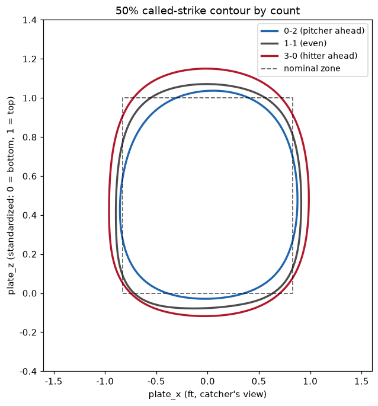
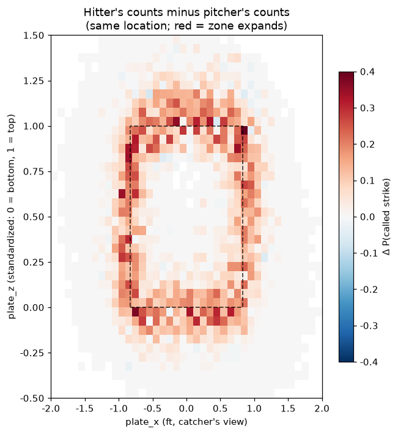
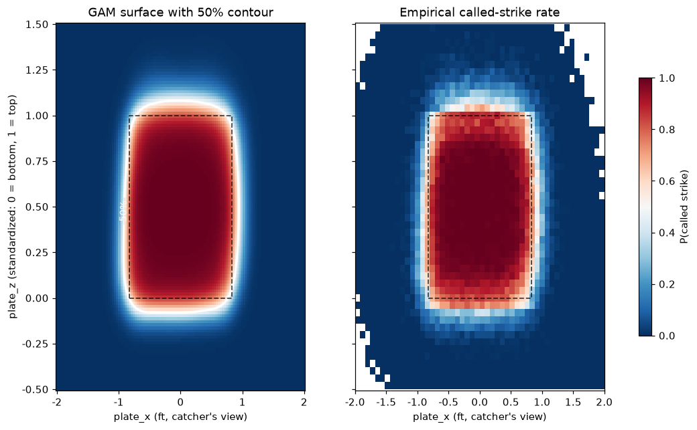
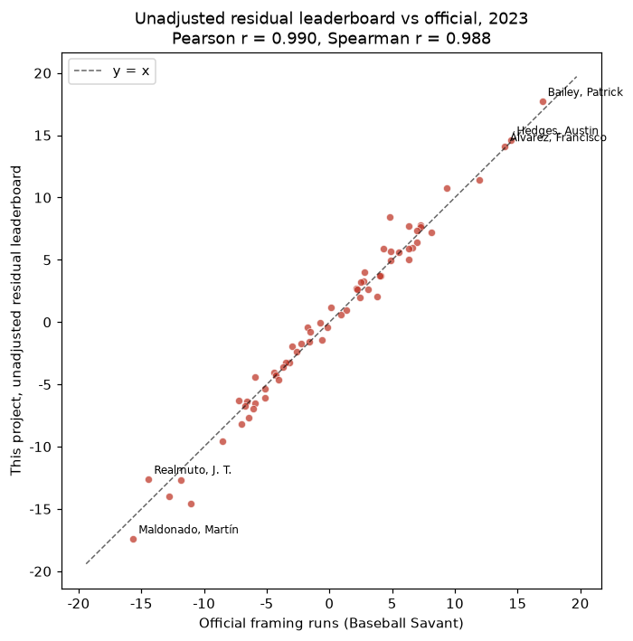
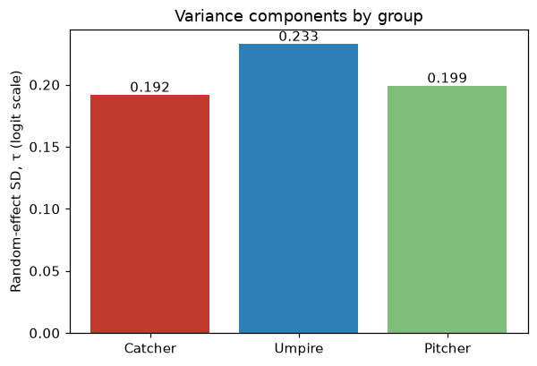
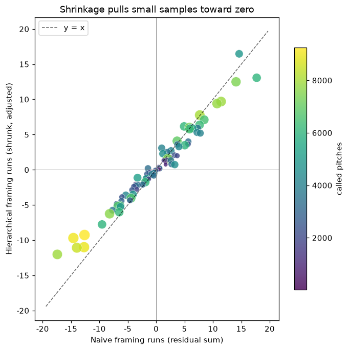
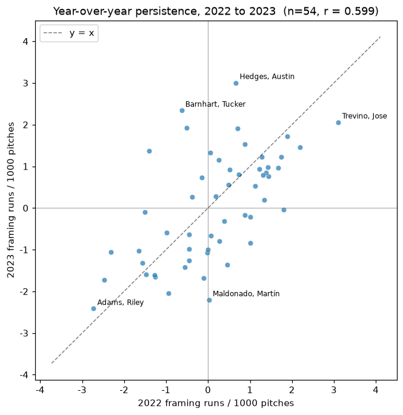
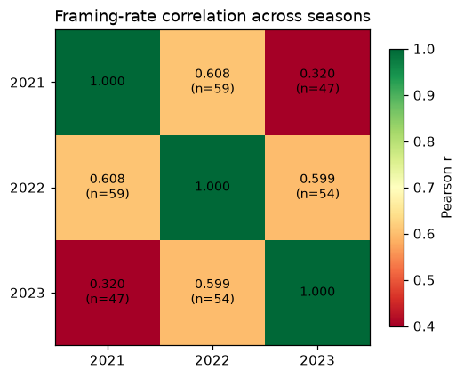
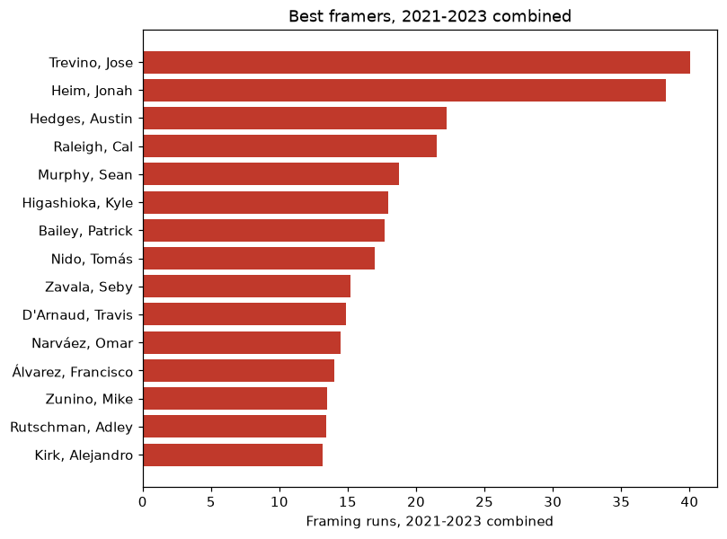
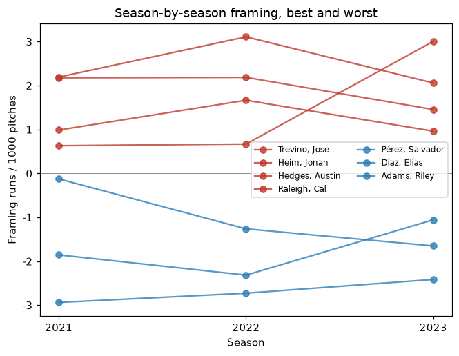

# Quantifying MLB Catcher Pitch Framing

**English** | [繁體中文](README.zh-TW.md)

This project started from a podcast - a Taiwanese data scientist working in an MLB front office mentioned that catcher framing was the first project he was handed there. So I tried it.

Some catchers get more strike calls than others on identical pitches. This project asks how much of that gap is associated with the catcher himself, and how much with the umpire and pitcher he happens to work with.

The approach: fit a strike-probability model on location and context but *not* catcher identity, treat its prediction as the counterfactual ("what would an average catcher get called here?"), and take the residual as a first-pass framing number. Then refit as a crossed random-effects model, so catcher, umpire, and pitcher effects have to compete for the same residual instead of all landing on the catcher.

Data is 1.06M called pitches from the 2021–2023 regular seasons. The unadjusted residual leaderboard tracks Baseball Savant's published framing runs at r = 0.99. Within a season the measure is highly repeatable (split-half r = 0.82, or 0.90 after correcting back to full-season length), and it carries across seasons at r ≈ 0.60.

<p align="center">
  <br>
  <em>The strike zone is not fixed: the 50% called-strike contour expands on 3-0 and shrinks on 0-2.</em>
</p>

---

## Results

### 1. The strike zone has a soft edge, and it moves with the count

Called-strike rate over the plate shows a wide transition band around the nominal zone. That band is the only place framing can matter — pitches down the middle are strikes no matter who catches them, and pitches a foot outside are balls.

The count moves that band. Comparing hitter's counts to pitcher's counts *at the same location* leaves a ring of difference around the zone edge, with almost nothing in the middle:

<p align="center">
  
</p>

This matters for the rest of the project. The raw 0-2 vs 3-0 gap in called-strike rate (8% vs 63%) is mostly a pitch-location artifact, since 3-0 pitches are aimed at the middle. Only after holding location fixed does the umpire's actual count bias show up.

### 2. Baseline model

A logistic GAM: a tensor spline over `plate_x` × standardized `plate_z`, plus additive terms for batter side, pitcher side, balls, and strikes. AUC is 0.98 on 2023, and the fitted surface tracks the empirical one closely enough to serve as the counterfactual.

<p align="center">
  
</p>

Standardizing height as `(plate_z − sz_bot) / (sz_top − sz_bot)` puts every batter's zone on a 0–1 scale, which is what makes a single surface meaningful across a 5'6" leadoff hitter and a 6'7" first baseman.

### 3. Unadjusted framing runs, compared against the official leaderboard

Summing `actual − predicted` per catcher and multiplying by 0.125 runs per stolen strike gives a leaderboard that tracks Baseball Savant's published numbers closely: r = 0.990, Spearman 0.988 across the 63 qualified catchers, with the same names at both ends.

<p align="center">
  
</p>

Two things are worth stating precisely here.

First, this is the **unadjusted residual leaderboard, not the hierarchical model**. It controls for pitch location and count, and nothing else. The hierarchical estimates in section 4 are a different quantity, and this correlation does not validate them.

Second, the two methods are not built the same way. Savant states that its framing runs include *park and pitcher adjustments*; the full model is not published, and its handling of umpire identity is not documented. This project applies neither a park nor a pitcher adjustment at this stage. So the agreement shows the location model is well calibrated and the run conversion is sane, and it suggests those adjustments do not reorder the leaderboard much. It is not independent confirmation that either number isolates catcher skill.

### 4. Hierarchical model

Two stages, since a full Bayesian fit on a million rows is impractical. Stage one freezes the GAM prediction; stage two puts three crossed random intercepts on the residual so they compete for it:

```
logit P(strike) = β0 + β1·logit(baseline) + θ_catcher + φ_umpire + ψ_pitcher
θ_catcher ~ N(0, τ_c²),  φ_umpire ~ N(0, τ_u²),  ψ_pitcher ~ N(0, τ_p²)
```

The variance components are the interesting part. In 2023, umpire-to-umpire variation (τ = 0.233) exceeds catcher variation (τ = 0.192), and the pitcher term (τ = 0.199) is about the same size as the catcher's. Under this specification, who is working the plate accounts for more variation in borderline calls than who is receiving.

<p align="center">
  
  
</p>

Shrinkage behaves as it should. Catchers with 6,000+ called pitches keep about 85% of their raw value; backups under 500 pitches keep roughly a quarter of theirs, however extreme the raw number looked. Across qualified catchers the spread narrows to 82% of the naive version, and it narrows on both sides. The naive estimate exaggerates how far apart catchers are; it does not inflate everyone upward.

These are associations under one model specification, not identified causal effects. Pitch type, velocity, movement, batter identity, ballpark, and the fact that catchers and pitchers are not randomly paired all remain unmodeled.

### 5. Reliability

Splitting each catcher's 2023 pitches at random into halves and correlating the two gives r = 0.82 (mean of 50 splits). Corrected back to full-season length with Spearman–Brown, that is R = 0.90. Between seasons, 2022 predicts 2023 at r = 0.599.

Both numbers come from the unadjusted residual rate rather than the hierarchical estimates, so that half-seasons and single seasons stay comparable without refitting the mixed model each time.

<p align="center">
  
</p>

### 6. Three seasons

Pooling 2021–2023 gives steadier per-catcher numbers — Jose Trevino leads at +40 runs over the three years — and fills in the persistence picture. Consecutive seasons correlate at 0.603 on average; a two-year gap drops to 0.320. That decay is close to what a simple AR(1) process predicts (0.603² = 0.364), so framing looks less like a fixed trait and more like one that drifts a little each year.

<p align="center">
  
  
</p>

<p align="center">
  <br>
  <em>The strongest framers stay above zero all three years; the weakest stay below.</em>
</p>

Refitting the hierarchical model on all 1.04M modeling rows, with effects shared across seasons, gives the most stable per-catcher estimate in the project. The three variance components converge there (τ ≈ 0.18–0.19), with umpire still the largest.

### 2023 leaderboard (hierarchical model)

| Catcher | Called pitches | Framing runs |
|---|--:|--:|
| Austin Hedges | 4,865 | +16.5 |
| Patrick Bailey | 6,038 | +13.1 |
| Francisco Álvarez | 7,430 | +12.5 |
| Jonah Heim | 7,870 | +9.7 |
| William Contreras | 7,802 | +9.4 |
| … | | |
| Elías Díaz | 8,462 | −11.1 |
| Keibert Ruiz | 8,926 | −11.0 |
| Martín Maldonado | 7,891 | −12.0 |

At roughly 10 runs to a win, the spread from best to worst is close to three wins — none of which shows up in a traditional stat line.

---

## Methods overview

| Stage | What | Notebook / module |
|---|---|---|
| Data pipeline | Fetch Statcast month by month, keep called pitches, standardize `plate_z`, store parquet | [`data/fetch.py`](data/fetch.py) |
| EDA | 2D called-strike heatmaps, count effects | [`notebooks/01_eda.ipynb`](notebooks/01_eda.ipynb) |
| Baseline model | Logistic GAM strike-probability surface | [`models/baseline_gam.py`](models/baseline_gam.py), [`02_gam_baseline.ipynb`](notebooks/02_gam_baseline.ipynb) |
| Framing runs | Unadjusted residual runs, comparison with official leaderboard | [`models/framing_runs.py`](models/framing_runs.py), [`03_framing_runs.ipynb`](notebooks/03_framing_runs.ipynb) |
| Hierarchical model | Crossed catcher/umpire/pitcher random effects, shrinkage | [`models/hierarchical.py`](models/hierarchical.py), [`04_hierarchical.ipynb`](notebooks/04_hierarchical.ipynb) |
| Reliability | Split-half, year-over-year | [`models/reliability.py`](models/reliability.py), [`05_reliability.ipynb`](notebooks/05_reliability.ipynb) |
| Multi-season | Pooled leaderboard, persistence matrix, trajectories | [`06_multiseason.ipynb`](notebooks/06_multiseason.ipynb) |

Pitch data comes from Statcast via `pybaseball`. Home-plate umpires are not in Statcast, so they are pulled per game from the MLB Stats API and joined on `game_pk`. The official leaderboard used for comparison is read from Baseball Savant — `pybaseball.statcast_catcher_framing` is currently broken, and the legacy CSV endpoint silently ignores its `year` argument, so [`data/official.py`](data/official.py) parses the JSON embedded in the leaderboard page instead.

Scope is the 2021–2023 regular seasons (`game_type == 'R'`, so spring training and playoffs are out), called pitches only (`called_strike` / `ball`): 1.06M pitches, of which 1.04M survive the coordinate trim described under Limitations. 2026 onward is left out deliberately — the ABS challenge system went live in the majors that season, and while it does not replace human calls, it changes what a framing number means.

---

## Reproduce

Environment is managed with [uv](https://docs.astral.sh/uv/):

```bash
uv sync

# 1. pitch data, one season at a time (raw months are cached)
uv run python -m data.fetch --season 2021
uv run python -m data.fetch --season 2022
uv run python -m data.fetch --season 2023

# 2. baseline GAM per season → data/processed/statcast_<year>_baseline.parquet
uv run python -c "from models.baseline_gam import build_baseline_parquet as b; [b(y) for y in (2021,2022,2023)]"

# 3. home-plate umpires per season
uv run python -c "from data.umpires import fetch_umpires as f; [f(y) for y in (2021,2022,2023)]"

# 4. hierarchical models
uv run python -m models.hierarchical         # single season (2023)
uv run python -m models.hierarchical multi   # pooled 2021–2023

# 5. notebooks in order (01–03 need step 2; 04 needs steps 3–4; 06 needs all three seasons)
for nb in 01_eda 02_gam_baseline 03_framing_runs 04_hierarchical 05_reliability 06_multiseason; do
  uv run jupyter nbconvert --to notebook --execute notebooks/$nb.ipynb --inplace
done

# 6. README figures, English and Chinese
uv run python make_figures.py

uv run pytest -q
```

Rough runtimes: 15–20 min per season to fetch, ~2 min per baseline GAM, a few minutes for the single-season hierarchical fit, and about an hour for the pooled three-season fit. Every step caches its output, so only the first run is slow.

Data files, model caches, and the notebooks' own figure output are not version-controlled (see `.gitignore`); the commands above regenerate them. The figures embedded in this README are committed under [`docs/images/`](docs/images/) and come from [`make_figures.py`](make_figures.py) rather than from the notebooks, so the English and Chinese pages can carry labels in their own language.

## Project structure

```
data/
  fetch.py         monthly Statcast fetch, cleaning, standardization
  umpires.py       home-plate umpire per game (MLB Stats API)
  official.py      Baseball Savant framing leaderboard (comparison)
models/
  baseline_gam.py  first-stage GAM strike-probability model
  framing_runs.py  unadjusted residual framing runs, official comparison
  hierarchical.py  two-stage crossed random-effects model
  reliability.py   split-half and year-over-year reliability
notebooks/         01_eda … 06_multiseason
tests/             pipeline invariant checks (pytest)
make_figures.py    regenerates docs/images in both languages
docs/images/       en/ and zh/ figures used by the two READMEs
archive/           pre-project research plan, superseded by this README
```

## Limitations

- **Associational, not causal.** The mixed model adjusts for pitch location, count, batter side, pitcher side, and the identities of catcher, umpire, and pitcher. It does not model pitch type, velocity, movement, batter identity, or ballpark, and catchers are not randomly assigned to pitchers. The catcher term should be read as variation associated with the catcher under this specification.
- The mixed model is fit with variational Bayes (statsmodels) and hits the default iteration cap without fully converging. Fixed effects and variance components are stable across subsamples and seeds, and a synthetic-data check recovers known variance components accurately ([`tests/test_random_effects.py`](tests/test_random_effects.py)), but an MLE fit in R (`glmmTMB`) would be the stronger version.
- The count enters the baseline model additively, so it shifts the zone without reshaping it. The reshaping effect is real (see the contour plot above) and is shown by fitting each count separately, but it is not in the model that generates the framing numbers.
- Pitches beyond |plate_x| > 2.5 ft, or outside a standardized height of [−1, 2], are dropped before modeling to keep the spline from extrapolating: about 2% of pitches, of which exactly 1 of 7,386 in 2023 was a called strike. They carry essentially no framing signal.
- Pitchers with few called pitches are pooled into a single group so the mixed model stays tractable (< 100 pitches in the single-season fit, < 150 in the pooled fit). Their individual effects would shrink to near zero regardless.
- Run value is a flat 0.125 runs per stolen strike. The real value depends on the count — stealing strike three is worth far more than stealing ball one — so per-catcher totals are approximate.


## References

- [Pavlidis, H. & Brooks, D. (2014). *Framing and Blocking Pitches: A Regressed,Probabilistic Model*. Baseball Prospectus.](https://www.baseballprospectus.com/news/article/22934/)
- [Judge, J., Pavlidis, H. & Brooks, D. (2015). *Moving Beyond WOWY: A Mixed Approach to Measuring Catcher Framing*. Baseball Prospectus.](https://www.baseballprospectus.com/news/article/25514/)
- [Albert, J. (2023). *Called Strikes*.](https://bayesball.github.io/BLOG/Called_Strikes.html)
- Deshpande & Wyner (2017), *A Hierarchical Bayesian Model of Pitch Framing*, JQAS.
- Judge, Pavlidis & Brooks (Baseball Prospectus), *Moving Beyond WOWY*.
- [Baseball Savant catcher framing leaderboard](https://baseballsavant.mlb.com/catcher_framing) (methodology notes).

## Tech stack

Python 3.12 · polars · pandas · pybaseball · pyGAM · statsmodels · scikit-learn · matplotlib · uv
