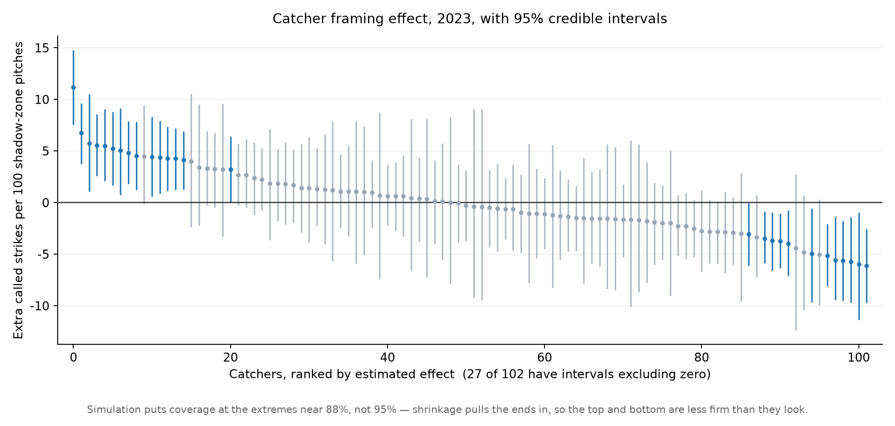
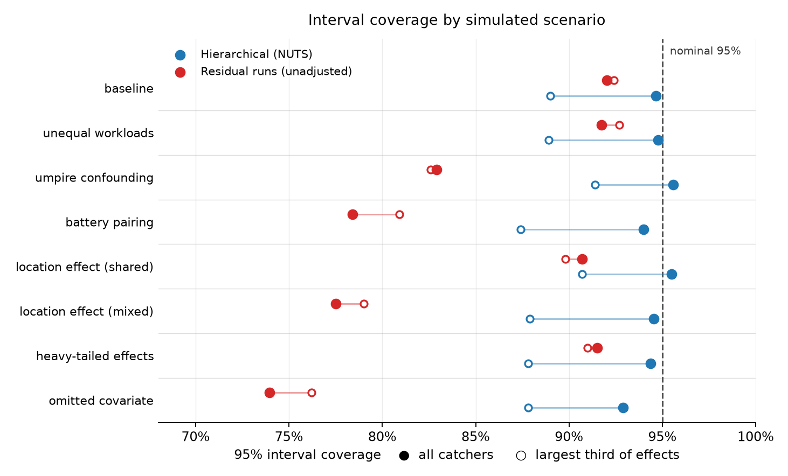
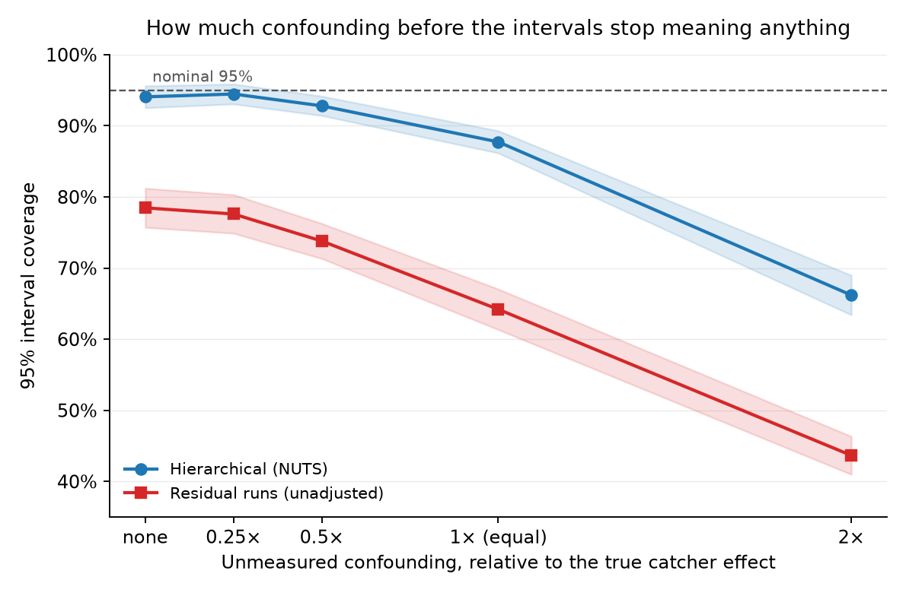

# Quantifying MLB Catcher Pitch Framing

**English** | [繁體中文](README.zh-TW.md)

This project started from a podcast - a Taiwanese data scientist working in an MLB front office mentioned that catcher framing was the first project he was handed there. So I tried it.

Some catchers get more strike calls than others on identical pitches. The first version of this project built a model to measure that: fit a strike-probability surface on location and context but *not* catcher identity, treat its prediction as the counterfactual, and let catcher, umpire, and pitcher effects compete for the residual. It produced a leaderboard, three variance components, and a correlation of 0.990 against Baseball Savant's published numbers.

This version asks a different question: do those numbers support the things the first version said about them?

Two of them do not, and the reason is the same in both cases — every number in the first version was a point estimate, with no interval attached and nothing checking whether the estimator deserved to be believed.

---

## What changed

The original analysis is unchanged and still reachable at tag [`v1.0`](../../tree/v1.0). Four specific claims were put to the test.

| Claim in v1 | Verdict |
|---|---|
| Umpire-to-umpire variation exceeds catcher-to-catcher variation (τ 0.233 vs 0.192) | **Not supported.** Reproduces on 2023 at P = 0.81, but flips between seasons and never reaches a level worth stating as fact |
| The leaderboard separates catchers | **Partly.** 23 of 63 qualified catchers have intervals excluding zero; most adjacent ranks are coin flips |
| r = 0.990 against Savant shows the location model is sound | **Yes, but it shows less than it appears to** — the correlation is almost entirely insensitive to estimator quality |
| The variational fit that produced all of this had not converged | **Harmless.** NUTS reproduces it to four decimal places |

The last row was the reason I started this round. It turned out to be the one thing that was fine.

---

## Data and design

2021–2023 regular seasons, called pitches only (`called_strike` / `ball`): 1.06M pitches, 1.04M after a coordinate trim. Pitch data from Statcast via `pybaseball`; home-plate umpires from the MLB Stats API, joined on `game_pk`. 2024 onward is out of scope, and 2026 is excluded deliberately — the ABS challenge system went live that season and changes what a framing number means.

Three design decisions carry most of the weight.

Out-of-sample baseline probabilities, everywhere. The framing signal is `actual − predicted`. If the prediction came from a model fit on the same pitches, the residuals are partly flattened by construction. Every baseline probability here comes from a model that never saw the pitch it is scoring: within 2021–2022 by five-fold cross-fitting split on `game_pk`, and for 2023 from a model fit only on 2021–2022.

Analysis restricted to the shadow zone, the pitches the baseline model puts at 0.2 < p̂ < 0.8. Framing can only matter where the call is genuinely in doubt. That band is 14.5% of called pitches and carries 60.8% of the Fisher information about a catcher's effect — information scales with p(1−p), and a pitch down the middle carries almost none. Standard errors inflate by a factor of 1.27, not the 2.6 the raw pitch counts suggest.

2023 held out and spent once. Model form, threshold, inference engine, estimand, and every reported quantity were settled on 2021–2022 before 2023 was touched. It was used a single time, at the end, so the new numbers could be compared against v1's published 2023 table on the same season.

---

## Results

### 1. The strike zone has a soft edge, and it moves with the count

Called-strike rate over the plate shows a wide transition band around the nominal zone. That band is the only place framing can matter — pitches down the middle are strikes no matter who catches them, and pitches a foot outside are balls.

<p align="center">
  <br>
  <em>The 50% called-strike contour expands on 3-0 and shrinks on 0-2.</em>
</p>

The count moves that band. Comparing hitter's counts to pitcher's counts *at the same location* leaves a ring of difference around the zone edge, with almost nothing in the middle:

<p align="center">
  
</p>

The raw 0-2 versus 3-0 gap in called-strike rate (8% against 63%) is mostly a location artifact, since 3-0 pitches are aimed at the middle. Only after holding location fixed does the umpire's actual count bias appear.

This section is carried over from v1 unchanged, and remains the clearest thing in the project.

### 2. The baseline model, scored honestly

Same model form as v1 — a tensor spline over `plate_x` × standardized `plate_z`, plus additive terms for batter side, pitcher side, balls, and strikes — refit on the 2021–2022 training split and scored out of sample.

| | Log loss |
|---|--:|
| Train (in-sample) | 0.17346 |
| Validation (out-of-sample, split by game) | 0.17149 |

The gap is nothing. With 410 basis functions against 550,000 rows and a penalty term, there was no room to overfit. v1 reporting in-sample fit statistics was a methodological flaw that did not distort any of its numbers — with one exception, in section 3.

Calibration is a different story. Out-of-fold, the model over-predicts strikes below p̂ = 0.5 and under-predicts above it, by one to two points across the shadow zone. That S-shape is real — it is monotone across six bins on 100,000 held-out pitches — but recalibrating it moves the leaderboard by 0.32 runs from end to end, against a spread of 28.5. Real, and not worth acting on.

### 3. What r = 0.990 does and does not show

v1's headline validation was the correlation between its unadjusted leaderboard and Savant's published framing runs. That correlation can now be decomposed, on 2023:

| Setup | r vs Savant |
|---|--:|
| v1: residual runs, all pitches, **in-sample** baseline | **0.990** |
| residual runs, all pitches, out-of-sample baseline | 0.958 |
| residual runs, shadow zone only, out-of-sample | 0.936 |
| hierarchical model, shadow zone, out-of-sample | 0.942 |

Reading down the column: dropping the in-sample baseline costs 0.032, restricting to the shadow zone costs a further 0.022, and switching from the unadjusted estimator to the hierarchical one gains 0.006.

The third of those is the one that matters. Section 6 shows the unadjusted estimator's nominal 95% intervals covering as little as 74% of the time under realistic confounding, while the hierarchical model stays calibrated. Replacing the first with the second moves the correlation against Savant by six thousandths.

So the correlation cannot be evidence that the estimator is sound: it barely moves when the estimator is replaced with one that is. v1's README already said this was not independent confirmation. The agreement reflects shared method, and part of it reflected nothing more than both sides fitting in-sample on the season they were scoring.

<p align="center">
  
</p>

### 4. Catcher, umpire, pitcher — with intervals this time

The model is v1's: baseline logit frozen as an offset, three crossed random intercepts competing for the residual. The engine is NUTS (numpyro) rather than variational Bayes, run on the shadow-zone subset with a non-centred parameterisation.

The engine swap changes nothing and was never going to. On identical data the two engines agree on per-catcher effects at r = 0.9999, and variational Bayes understates the posterior standard deviation by 5%. What NUTS provides is posterior *samples*, which is what a probability like the one below requires.

2023, the season v1 reported:

| | posterior mean | 89% interval |
|---|--:|---|
| τ catcher | 0.2001 | [0.169, 0.237] |
| τ umpire | 0.2264 | [0.196, 0.261] |
| τ pitcher | 0.2019 | [0.168, 0.237] |

P(τ_umpire > τ_catcher) = 0.81.

v1's ordering reproduces. But run the same fit on each season:

| | P(τ_umpire > τ_catcher) |
|---|--:|
| 2021 | 0.88 |
| 2022 | 0.41 |
| 2023 | 0.81 |
| 2021–2022 pooled | 0.46 |

The ordering flips between 2021 and 2022 and never exceeds 0.88. v1 did not miscalculate anything — its numbers reproduce closely. It stated as a finding about baseball something that is a coin flip in one of the three seasons it had in hand.

### 5. How far apart are catchers, really

<p align="center">
  
</p>

Grey intervals cover zero; blue ones do not. 2023:

| Restriction | Catchers | Intervals excluding zero | Pairs resolved at 95% |
|---|--:|--:|--:|
| All | 102 | 27 (26%) | 27% |
| ≥500 shadow pitches | 49 | 20 (41%) | 47% |
| ≥1000 shadow pitches | 15 | 8 (53%) | 55% |

Among the 63 catchers Savant lists as qualified, 23 have intervals excluding zero.

The ends of the distribution separate cleanly from zero. The middle does not, and most adjacent pairs are indistinguishable. On 2021–2022, where the top two are closer together, P(rank 1 beats rank 2) = 0.77.

The working plan set this down as an acceptable outcome before the figure existed, together with a commitment to report all three shadow-zone thresholds; it is in [`archive/PLAN.md`](archive/PLAN.md), dated in the commit history.

The plot carries a caption that the rest of this section cannot: simulation puts coverage at the extremes near 88%, not 95%. Shrinkage pulls the ends in, and the ends are exactly what a leaderboard is read for.

### 6. Testing the estimator against a known truth

Every external check available compares one estimate against another number whose truth is also unknown. Simulation is the only place the truth is set rather than inferred, which is why this is the part of the project that could not be dropped.

Eight scenarios, with known catcher, umpire and pitcher effects generated on the real pitch-location and workload distributions, 100 replications each, both estimators scored on bias, RMSE, coverage and rank recovery. Synthetic datasets are small by design — 30 catchers, ~500 pitches each. That is a compute trade-off, and it means the coverage figures should not be read as exact for full-season samples.

<p align="center">
  
</p>

The unadjusted estimator fails exactly where the confounding is. Its nominal 95% intervals cover 83% under umpire confounding, 78% under concentrated battery pairings, and 74% with an omitted covariate correlated with the catcher. Where there is no confounding it behaves. The hierarchical model stays between 92.9% and 95.6% throughout.

Three of these eight scenarios were built specifically to break the hierarchical model's assumptions — a location-varying catcher effect, heavy-tailed effects violating the normal prior, an omitted covariate — and none of them did. That is a weaker result than this project set out to find. It is also easier to defend.

What the intervals do not survive is unmeasured confounding correlated with the catcher. Rather than pick one confounder size, the strength was swept:

<p align="center">
  
</p>

Coverage holds while the confounding stays below about half the size of the effect being measured, falls to 88% when it matches it, and reaches 66% at twice. v1's Limitations noted in one sentence that catchers are not randomly assigned to pitchers. This is that sentence with a number attached.

An unplanned finding, visible as the gap between the filled and hollow markers above: coverage for the largest third of effects runs 3 to 6 points below coverage overall, in every scenario including the baseline. The unadjusted estimator shows no such gap because it shrinks nothing; its intervals are simply too narrow everywhere.

### 7. What the external checks could not distinguish

The two estimators, run on identical pitches, put side by side against the two external checks available:

| Check | Hierarchical | Unadjusted | 95% CI on the difference |
|---|--:|--:|---|
| Year over year, 2021 → 2022 (46 catchers) | 0.684 | 0.637 | [−0.008, +0.103] |
| vs Savant, 2021 (59 catchers) | 0.892 | 0.914 | [−0.015, +0.068] |
| vs Savant, 2022 (60 catchers) | 0.952 | 0.961 | [−0.010, +0.027] |

Every interval covers zero. Paired bootstrap over catchers, 8,000 resamples.

Simulation separates these two estimators decisively — 74% coverage against 93%. The external checks cannot separate them at all. With 46 to 60 catchers, only a correlation gap larger than about 0.1 would be visible, and the gap is not that large.

So the external checks cannot do the job the simulation does. That is also the precise sense in which r = 0.990 was never validation: a check with no power to separate a good estimator from a bad one says nothing about which one you have.

### 8. Reliability and persistence

Carried over from v1 unchanged, and still standing. Splitting each catcher's pitches at random into halves gives r = 0.82 (mean of 50 splits), or R = 0.90 corrected back to full-season length by Spearman–Brown; 2022 predicts 2023 at r = 0.599. Both figures come from the unadjusted residual rate rather than the hierarchical estimates, so that half-seasons and full seasons stay comparable without refitting the mixed model each time.

Pooling 2021–2023 gives steadier per-catcher numbers — Jose Trevino leads at +40 runs over the three years — and fills in the persistence picture. Consecutive seasons correlate at 0.603 on average; a two-year gap drops to 0.320, close to what a simple AR(1) process predicts (0.603² = 0.364). Framing looks less like a fixed trait and more like one that drifts a little each year.

<p align="center">
  
  
</p>

<p align="center">
  <br>
  <em>The strongest framers stay above zero all three years; the weakest stay below.</em>
</p>

Refitting the hierarchical model on all 1.04M modelling rows, with effects shared across seasons, gave v1 its most stable per-catcher estimate; the three variance components converge there to τ ≈ 0.18–0.19, with umpire still nominally the largest. Section 4 is what those three numbers look like once they carry intervals.

---

## 2023 leaderboard

Framing runs over shadow-zone pitches, with 95% credible intervals, against Savant's published figure for the same season. Note the denominators differ: this counts only the 14.5% of pitches where the call was in doubt.

| Catcher | Shadow pitches | Framing runs | 95% interval | Savant |
|---|--:|--:|---|--:|
| Austin Hedges | 791 | +11.1 | [+7.5, +14.6] | +14.5 |
| Francisco Álvarez | 1,088 | +9.2 | [+5.1, +13.1] | +14.0 |
| Patrick Bailey | 965 | +6.7 | [+3.1, +10.3] | +17.0 |
| Jason Delay | 633 | +4.4 | [+1.7, +7.1] | +6.6 |
| Victor Caratini | 640 | +4.2 | [+1.3, +7.1] | +7.2 |
| … | | | | |
| Jose Herrera | 418 | −2.9 | [−4.9, −0.7] | −4.1 |
| Riley Adams | 424 | −3.0 | [−5.0, −0.9] | −6.1 |
| Logan O'Hoppe | 540 | −4.1 | [−6.5, −1.7] | −6.4 |

The names at the top are v1's names — Hedges, Álvarez and Bailey led v1's 2023 table too. What changed is not who is on the list but how much confidence the list will carry: 40 of these 63 have intervals that include zero.

---

## What I'd do differently

I started this round for the wrong reason. The thing that bothered me about v1 was that its hierarchical model was fit by variational Bayes and had not converged. That turned out to be the one thing that was fine. The real gap — no intervals anywhere, and no check that the estimator deserved belief — was sitting in plain sight and I had ranked it second.

I read noise as signal more than once. A single 971-game validation split produced a shadow-zone bias significant at p ≈ 0.03; five-fold cross-fitting over all 4,856 games showed it was nothing, and I had been within an hour of rewriting the calibration pipeline around it. A scenario that looked like it degraded coverage at 10 replications was at nominal at 100. Both times the number pointed where I already wanted to go.

Three of my simulation scenarios tested nothing. A location-varying catcher effect collapses to a constant when every catcher faces the same distribution of locations. An omitted covariate defined at the pitcher level is absorbed whole by the pitcher random effect. The lesson, arrived at the slow way: before writing a generator, work out how the fitted model will absorb what you are about to generate.

Timing a JAX program without blocking measures dispatch, not compute. The first timings said a 4-chain run finished in two seconds.

Each of these is in the working log with the date and the wrong turn intact.

What I would add next: the ABS challenge era. 2026 was excluded here because the generating process changed, but "what happens to a framing number when the rules change underneath it" is a better question than anything in this document.

---

## Methods overview

| Stage | What | Module |
|---|---|---|
| Data pipeline | Monthly Statcast fetch, cleaning, standardization | [`data/fetch.py`](data/fetch.py) |
| Split | Train/validation by `game_pk`, 2023 holdout | [`models/splits.py`](models/splits.py) |
| Baseline | Logistic GAM, fit on train, scored out of sample | [`models/baseline_v2.py`](models/baseline_v2.py) |
| Cross-fitting | Out-of-fold baseline probabilities for the train pool | [`models/crossfit.py`](models/crossfit.py) |
| Hierarchical model | Crossed random effects, NUTS on the shadow zone | [`models/hierarchical_v2.py`](models/hierarchical_v2.py) |
| Engine comparison | VB vs NUTS, season stability | [`models/compare_engines.py`](models/compare_engines.py) |
| Intervals | Δ posterior, pairwise comparison probabilities | [`models/intervals.py`](models/intervals.py) |
| Simulation | Eight scenarios, two estimators, four metrics | [`sim/`](sim/) |
| External validation | Year over year, Savant comparison | [`models/validate.py`](models/validate.py) |
| Holdout | 2023, spent once | [`models/holdout.py`](models/holdout.py) |

v1's modules (`baseline_gam.py`, `framing_runs.py`, `hierarchical.py`, `reliability.py`, notebooks 01–06) are unchanged and still run.

## Reproduce

Environment is managed with [uv](https://docs.astral.sh/uv/). v1's pipeline is unchanged; see [`v1.0`](../../tree/v1.0) for its instructions. This round adds:

```bash
uv sync

# out-of-fold baseline probabilities for 2021–2022 (~20 min, cached)
uv run python -m models.crossfit

# baseline model scored out of sample
uv run python -m models.baseline_v2

# posterior intervals and pairwise comparisons
uv run python -m models.intervals

# simulation: eight scenarios x 100 reps (~2 hours), then the confounder sweep
uv run python -m sim.run 100
uv run python -m sim.run sweep 50

# external validation, then the holdout
uv run python -m models.validate
uv run python -m models.holdout

uv run python make_figures_v2.py
```

Data files, model caches and simulation output are not version-controlled; the commands regenerate them.

## Project structure

```
data/
  fetch.py             monthly Statcast fetch, cleaning, standardization
  umpires.py           home-plate umpire per game (MLB Stats API)
  official.py          Baseball Savant framing leaderboard (comparison)
models/
  baseline_gam.py      v1 first-stage GAM strike-probability model
  framing_runs.py      v1 unadjusted residual framing runs
  hierarchical.py      v1 two-stage crossed random-effects model (VB)
  reliability.py       split-half and year-over-year reliability
  splits.py            train/validation by game, 2023 holdout
  baseline_v2.py       baseline fit on train, scored out of sample
  crossfit.py          out-of-fold baseline probabilities
  hierarchical_v2.py   crossed random effects, NUTS on the shadow zone
  compare_engines.py   VB vs NUTS, season stability
  intervals.py         posterior intervals and pairwise probabilities
  identify.py          identifiability diagnostics
  validate.py          year-over-year and Savant comparison
  holdout.py           2023, spent once
sim/                   simulation study: generate, estimate, run
notebooks/             01_eda … 06_multiseason (v1)
tests/                 pipeline invariant checks (pytest)
make_figures.py        v1 figures, both languages
make_figures_v2.py     v2 figures, both languages
docs/images/           en/ and zh/ figures used by the two READMEs
archive/               the research plans for both rounds, superseded
```

## Limitations

- **Associational, not causal.** The catcher term is variation associated with the catcher under this specification. Section 6 quantifies what unmeasured confounding does to it: coverage falls to 88% when a catcher-correlated confounder matches the size of the effect being measured, and to 66% at twice. Nothing in the data can rule that out.
- **Coverage at the extremes is about 88%, not 95%**, in every simulated scenario. The top and bottom of the leaderboard are less firm than the intervals suggest.
- Simulation used 30 catchers and ~500 pitches each. Coverage figures are not exact for full-season sample sizes.
- Pitch type, velocity, movement, batter identity and ballpark remain unmodelled. Savant applies park and pitcher adjustments; this does not.
- The count enters the baseline additively, shifting the zone without reshaping it. The reshaping effect is real, and shown by fitting each count separately, but it is not in the model that generates the framing numbers.
- Pitches beyond |plate_x| > 2.5 ft, or outside a standardized height of [−1, 2], are dropped before modelling to keep the spline from extrapolating: about 2% of pitches, of which exactly 1 of 7,386 in 2023 was a called strike. They carry essentially no framing signal.
- Pitchers with few called pitches are pooled into a single group to keep the level count tractable (< 100 pitches in a single-season fit, < 150 pooled). Their individual effects would shrink to near zero regardless.
- Run value is a flat 0.125 runs per stolen strike, as in v1. The real value depends on the count — stealing strike three is worth far more than stealing ball one — so per-catcher totals are approximate. Making it count-dependent rescales the leaderboard and changes no statistical conclusion.
- The holdout discipline cost something: with 2023 reserved, year-over-year stability rests on a single season pair, so there is no decay curve.
- The baseline model is mildly miscalibrated in the shadow zone (section 2). Correcting it moves the leaderboard by about 1% of its spread.

## References

- [Pavlidis, H. & Brooks, D. (2014). *Framing and Blocking Pitches: A Regressed,Probabilistic Model*. Baseball Prospectus.](https://www.baseballprospectus.com/news/article/22934/)
- [Judge, J., Pavlidis, H. & Brooks, D. (2015). *Moving Beyond WOWY: A Mixed Approach to Measuring Catcher Framing*. Baseball Prospectus.](https://www.baseballprospectus.com/news/article/25514/)
- [Albert, J. (2023). *Called Strikes*.](https://bayesball.github.io/BLOG/Called_Strikes.html)
- Deshpande & Wyner (2017), *A Hierarchical Bayesian Model of Pitch Framing*, JQAS.
- [Baseball Savant catcher framing leaderboard](https://baseballsavant.mlb.com/catcher_framing) (methodology notes).

## Tech stack

Python 3.12 · polars · pandas · pybaseball · pyGAM · statsmodels · numpyro/JAX · scikit-learn · matplotlib · uv
