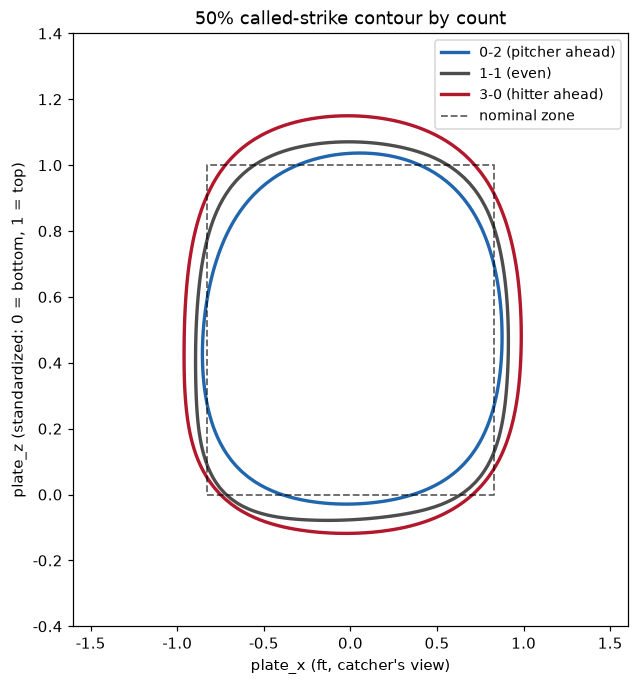
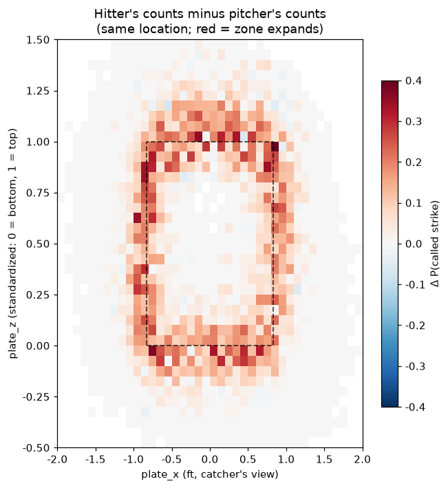
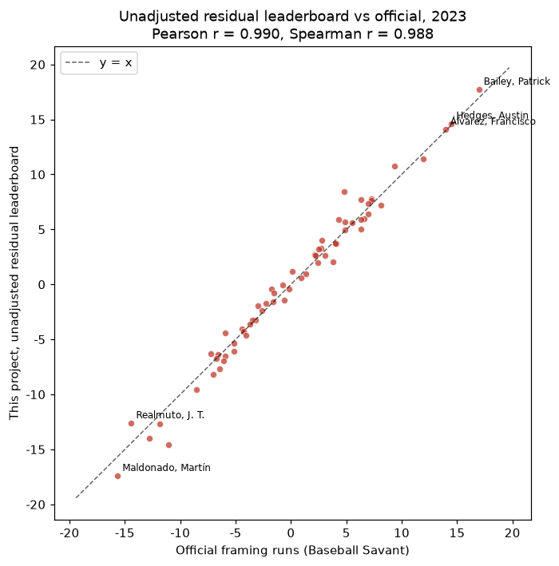
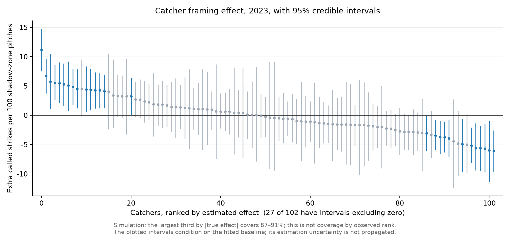
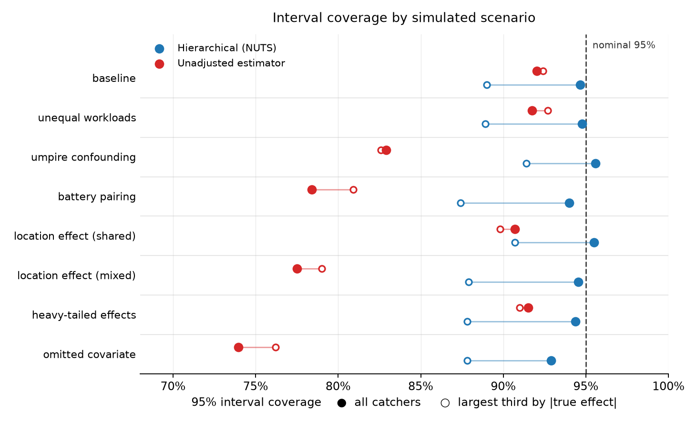
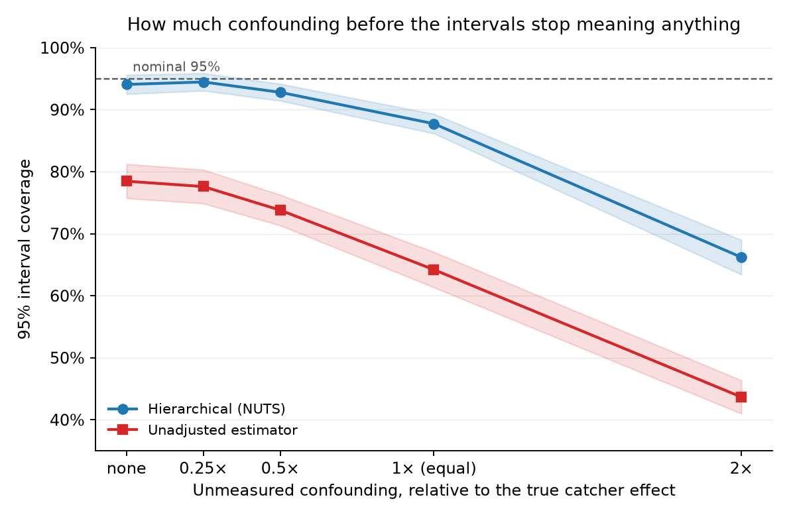
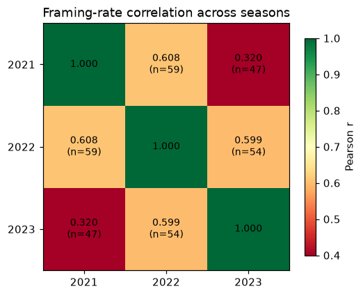
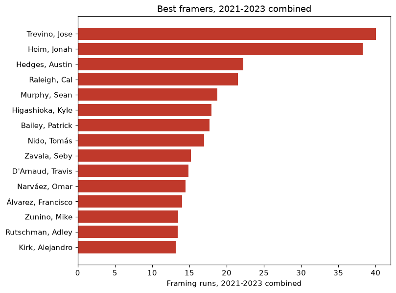
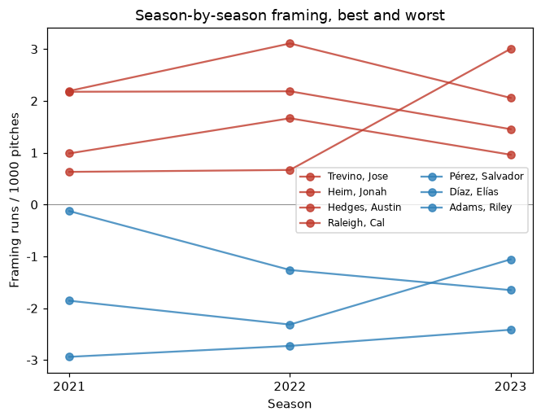

# Quantifying MLB Catcher Pitch Framing

**English** | [繁體中文](README.zh-TW.md)

This project started from a podcast - a Taiwanese data scientist working in an MLB front office mentioned that catcher framing was the first project he was handed there. So I tried it.

Some catchers get more strike calls than others on identical pitches. The first version of this project measured that in two steps. It fit a strike-probability model on location and context but *not* catcher identity, and treated its prediction as the expected call for a pitch of that description. Then it let catcher, umpire, and pitcher effects compete for the residual. The result was a leaderboard, three variance components, and a correlation of 0.990 with Baseball Savant's published framing runs.

This second version checks whether those numbers support what the first version said about them. The variance-component ordering does not, and the leaderboard only partly does. In both cases the reason is the same: every number in v1 was a point estimate with no interval, and its one synthetic-data test checked that effects landed on the right groups, not how the estimator behaves. The correlation holds up, but it shows less than it seems to.

---

## What changed

The original analysis is unchanged and still available at tag [`v1.0`](../../tree/v1.0). This round tested four things v1 said or relied on.

| v1 | Verdict |
|---|---|
| Umpire-to-umpire variation exceeds catcher-to-catcher variation (τ 0.233 vs 0.192) | **Not supported.** It reproduces on 2023 at P = 0.81 and leans the same way in four of five seasons, but flips in 2022, moves with the shadow-zone threshold, and never reaches 0.95 |
| The leaderboard ranks catchers on point values alone | **Partly supported.** 23 of 63 qualified catchers have intervals excluding zero; most adjacent ranks are coin flips |
| r = 0.990 against Savant shows the location model is sound | **The conclusion holds, but section 2 is what shows it.** The 0.990 depends on the baseline having the season's overall strike rate right, which one re-estimated intercept restores (0.989), and the correlation cannot see interval calibration, which is where the two estimators differ most |
| The variational fit behind all of this had not converged | **Harmless.** Refit with NUTS on the same 2022 data, per-catcher effects correlate with the VB fit at r = 0.9999 |

The last row is why I started this round, and it turned out not to matter.

---

## Data and design

2021–2023 regular seasons, called pitches only (`called_strike` / `ball`): 1.06M pitches, 1.04M after a coordinate trim. Pitch data comes from Statcast via `pybaseball`; home-plate umpires come from the MLB Stats API, joined on `game_pk`. 2024 and 2025 (0.71M called pitches) were added after v2 was locked, as two more evaluation seasons; they do not enter the training data. 2026 is left out of v2 on purpose: the ABS challenge system went live that season, and it changes what a framing number means. The postscript takes it up separately.

Three design decisions matter most.

**Out-of-sample baseline probabilities throughout.** The framing signal is `actual − predicted`. If the prediction comes from a model fit on the same pitches, the residuals are partly flattened by the fit itself. Every baseline probability here comes from a model that never saw the pitch: within 2021–2022 by five-fold cross-fitting split on `game_pk`, and for 2023–2025 from a model fit only on 2021–2022.

**Analysis restricted to the shadow zone.** Here that means a band defined by the model: the pitches the baseline puts at 0.2 < p̂ < 0.8. It is not Statcast's Shadow Zone, which is geometric, one ball-width either side of the rule-book edge. Framing can only matter where the call is in doubt, and the numbers bear that out. Measured on 2023 with v1's baseline, the band holds 14.5% of called pitches but 60.8% of the Fisher information about a catcher's effect, because information scales with p(1−p) and a pitch down the middle carries almost none. (With the v2 baseline the band holds 15% of pitches.) Standard errors grow by a factor of 1.28, not the 2.6 the raw pitch counts would suggest ([`results/shadow_information.csv`](results/shadow_information.csv)).

**2023 locked for all of v2; its model fit once.** Model form, threshold, inference engine, estimand and the list of reported quantities were all settled on 2021–2022 before 2023 was touched. The hierarchical model was fit on it a single time, at the end, so the new numbers could be compared with v1's published 2023 table. Later diagnostics read that fit's posterior and scored the baseline on 2023's pitches, without refitting the model or informing any choice (METHODS §2.4). That makes it a locked evaluation set rather than an untouched holdout. v1 had already analyzed 2023 and published on it, and that table is the reason this round uses the season at all. The lock means no v2 decision was tuned on 2023. It does not make 2023 unseen. 2024 and 2025 were fetched only after every decision was made, so they are cleaner still, and each was fit once on the same path.

---

## Results

### 1. The strike zone has a soft edge, and it moves with the count

Called-strike rate over the plate shows a wide transition band around the nominal zone. That band is the only place framing can matter: pitches down the middle are strikes no matter who catches them, and pitches a foot outside are balls.

   
  <em>The 50% called-strike contour expands on 3-0 and shrinks on 0-2.</em>

The count moves that band. Comparing hitter's counts with pitcher's counts *at the same location* leaves a ring of difference around the zone edge and almost nothing in the middle:

  

The raw 0-2 vs 3-0 gap in called-strike rate (8% vs 63%) is mostly a location artifact, since 3-0 pitches are aimed at the middle. Only after holding location fixed does the umpire's actual count bias show up.

This section is carried over from v1 unchanged.

### 2. Baseline model, scored out of sample

The model form is the same as v1's: a tensor spline over `plate_x` × standardized `plate_z`, plus additive terms for batter side, pitcher side, balls, and strikes. It is refit on the 2021–2022 training split and scored on held-out games.

| | Log loss |
|---|--:|
| Train (in-sample) | 0.17346 |
| Validation (out-of-sample, split by game) | 0.17149 |

On this split there is no visible gap in overall log loss between the two (about 410 basis functions against 550,000 rows, with a penalty term). So v1's use of in-sample fit statistics was a methodological flaw that did not visibly inflate its fit. That is narrower than saying none of v1's estimates were affected. The only other check is the Savant correlation in section 3, where re-estimating the baseline's intercept recovers most of the gap.

The model is never refit. On the later seasons its overall strike rate drifts: 0.8 points too high in 2023, 0.6 in 2024 and 2.6 in 2025 ([`results/baseline_transport.csv`](results/baseline_transport.csv)). The overall log loss stays close to 0.169 in every season, so it gave no warning, but log loss is not comparable across seasons, because each season's mix of pitches is easier or harder to predict. Within a season it does respond: re-estimating the intercept on 2025 lowers it from 0.1693 to 0.1633. Section 7 shows what the drift does to the unadjusted estimator.

Calibration is weaker. Out of fold, the model over-predicts strikes below p̂ = 0.5 and under-predicts above it, by 0.7 to 1.6 points across the shadow zone. The pattern is consistent on 100,000 held-out pitches: all three bins below 0.5 over-predict and all three above under-predict. It does not matter much for the results, though. Recalibrating shifts per-catcher runs by amounts spanning 0.32 runs, against a spread of 31.5 runs across the same 84 catchers, so the baseline was left as is.

### 3. What r = 0.990 does and does not show

v1's main external check was the correlation between its unadjusted leaderboard and Savant's framing runs. On 2023 that correlation can now be taken apart ([`results/savant_decomposition.csv`](results/savant_decomposition.csv)):

| Setup | r vs Savant |
|---|--:|
| v1: residual runs, all pitches, **in-sample** baseline | **0.990** |
| residual runs, all pitches, out-of-sample baseline | 0.958 |
| the same, with the baseline's intercept re-estimated on 2023 | 0.989 |
| residual runs, shadow zone only, intercept re-estimated | 0.960 |
| hierarchical model, shadow zone, out-of-sample | 0.942 |

Moving to an out-of-sample baseline costs 0.032. Re-estimating a single number on 2023, the baseline's intercept, brings the correlation back to 0.989. (Re-estimating one parameter on the season is itself in-sample, but one intercept cannot overfit 350,000 pitches.) The 0.990 and the 0.989 come from two different pipelines, so the small remaining difference does not measure what the in-sample fit of the zone's shape contributed. It says only that once the intercept is right, little is left to explain.

The out-of-sample baseline was fit on 2021–2022, and it overpredicts 2023's overall strike rate by 0.8 points (section 2). Unadjusted framing runs are the residual times the number of pitches, with no intercept of their own, so a season-wide offset becomes a term proportional to playing time. Before the correction, a catcher's runs correlate −0.38 with the number of pitches he received; after it, −0.16, close to Savant's −0.14. On this measure, most of what separated v1's in-sample baseline from an out-of-sample one was the season's overall strike rate. The later seasons show the same thing: with the intercept re-estimated, the unadjusted estimator reaches 0.990 against Savant in 2024 and 0.988 in 2025. Section 7 shows what happens in 2025 without it.

Restricting to the shadow zone then costs 0.029, and switching from the unadjusted estimator to the hierarchical one costs another 0.018. The hierarchical model estimates its own intercept in every fit, so the like-for-like comparison is with the corrected unadjusted estimator. Against the uncorrected one (0.936), the switch would seem to add 0.006.

The last step is the important one. Section 6 shows how the two estimators differ. The biggest difference is in their intervals: under confounding, the unadjusted estimator's nominal 95% intervals cover as little as 74% of the time, while the hierarchical model's stay between 92.9% and 95.6%. A correlation between point estimates cannot detect that. The point estimates differ less. Under confounding, the hierarchical model's RMSE is about 40% lower and its rank correlation with the true effects is 0.04 to 0.05 higher. Against Savant, the switch moves the correlation by 0.018 the other way, which is within the noise of this check: the paired interval on 2023 is about ±0.026 wide.

So the correlation is not evidence that an estimator is sound. One intercept moves it by 0.031. The choice of estimator moves it by less, and by an amount the check cannot distinguish from zero. v1's README already said the agreement was not independent confirmation, since it reflects a shared method. On this evidence, what fitting in-sample adds to it is mostly the season's overall strike rate, which Savant, presumably fitting within season, also has right.

  

### 4. Catcher, umpire, pitcher, with intervals

The model is v1's: the baseline logit enters as a calibration covariate, and three crossed random intercepts compete for the residual. The engine is now NUTS (numpyro) instead of variational Bayes, run on the shadow-zone subset with a non-centered parameterization.

The covariate's coefficient is estimated rather than fixed, so strictly it is not an *offset*, which by definition has its coefficient held at 1. Fit freely on the 2021–2022 train pool, it comes out at **1.089, 95% interval [1.071, 1.107]**, which excludes 1. The extra freedom is useful: it absorbs the slope part of the S-shaped miscalibration in section 2 before the random effects see the residual.

Fixing it at 1 and refitting barely changes anything. Per-catcher runs correlate at r = 0.9997, the largest single-catcher shift is 0.40 runs against a spread of 28.9, the top ten are the same ten, and P(τ_umpire > τ_catcher) stays at 0.46. So the offset assumption is wrong, but the results do not depend on it. This check was run on the train pool, since 2023 had already been used ([`models/sensitivity.py`](models/sensitivity.py), [`results/sensitivity_slope.csv`](results/sensitivity_slope.csv)).

Switching engines did not change the estimates either. On identical data (2022, shadow zone), the two engines agree on per-catcher effects at r = 0.9999, and variational Bayes understates the posterior standard deviation by 5%. What NUTS adds is the joint posterior. The VB fit is mean-field: it gives each parameter its own mean and spread and treats them as independent, which drops the correlations that a probability like the one below depends on.

2023, the season v1 reported:

| | posterior mean | 95% interval |
|---|--:|---|
| τ catcher | 0.2001 | [0.163, 0.247] |
| τ umpire | 0.2264 | [0.190, 0.270] |
| τ pitcher | 0.2019 | [0.162, 0.245] |

P(τ_umpire > τ_catcher) = 0.81.

So v1's ordering reproduces on 2023. Running the same fit on each season gives the table below. 2024 and 2025 were added after v2 was locked and are fit the same way as 2023 (section 7).

| | P(τ_umpire > τ_catcher) |
|---|--:|
| 2021 | 0.88 |
| 2022 | 0.41 |
| 2023 | 0.81 |
| 2024 | 0.92 |
| 2025 | 0.74 |
| 2021–2022 pooled | 0.46 |

The ordering flips between 2021 and 2022. In the other four seasons it leans toward the umpire, but no season reaches 0.95. v1's numbers were not wrong; they reproduce closely. The problem is that v1 stated the ordering as a finding about baseball, when in one of the three seasons it had, the ordering is close to a coin flip. The two later seasons make the lean more consistent without making it decisive.

All three components also shrink a little from 2023 to 2025: catcher 0.200, 0.183, 0.172; umpire 0.226, 0.223, 0.188. Every interval overlaps the others ([`results/variance_components.csv`](results/variance_components.csv)). 2025 is also the season the baseline fits worst (section 7). In a logistic model, variation the baseline leaves unexplained pulls every other effect toward zero, so part of the 2025 drop may come from the baseline rather than from umpires or catchers.

The shadow-zone threshold moves it too. On the pooled train pool, P(τ_umpire > τ_catcher) is 0.50, 0.46 and 0.63 at the three thresholds committed to in advance ([`results/sensitivity_threshold.csv`](results/sensitivity_threshold.csv)). Both the choice of season and the choice of threshold shift the ordering, and neither shifts it far enough to settle the question. That is a stronger reason for "not supported" than the season flip alone.

### 5. How far apart are catchers?

  

Gray intervals cover zero; blue ones do not. 2023:

| Restriction | Catchers | Intervals excluding zero | Pairs ordered with ≥95% probability |
|---|--:|--:|--:|
| All | 102 | 27 (26%) | 27% |
| ≥500 shadow pitches | 49 | 20 (41%) | 47% |
| ≥1000 shadow pitches | 15 | 8 (53%) | 55% |

Among the 63 catchers Savant lists as qualified, 23 have intervals excluding zero.

The two ends of the distribution separate clearly from zero, but the middle does not, and neighbors in the ranking are mostly indistinguishable. Of the 101 adjacent pairs, 99 have P(higher > lower) below 0.6, with a median of 0.52. Even among the 15 catchers with at least 1,000 shadow pitches, the median is 0.62. The top of 2023 is the exception, with Hedges ahead of Álvarez at P = 0.98; on 2021–2022 the top two are not separable (0.77). It stays the only exception. The top two do not separate on 2024 (0.65) or 2025 (0.70), where 20% and 16% of catchers have intervals excluding zero ([`results/separability.csv`](results/separability.csv)).

Before running this, I wrote down in a working plan that a result like this would be acceptable, and that all three shadow-zone thresholds would be reported. The plan was private, so its timing cannot be verified from outside. What can be checked is whether the reported threshold turned out to be the convenient one.

All three are reported ([`results/sensitivity_threshold.csv`](results/sensitivity_threshold.csv), and METHODS §2.3). The leaderboard barely moves: per-catcher runs correlate at 0.991 and 0.987 with the reported band. The reported band is neither the one with the narrowest intervals nor the one that separates the most catchers from zero. The share of catchers separated from zero is 24.8%, 23.0% and 16.2%, from the widest band to the narrowest.

The figure's caption adds one caveat from the simulation: coverage at the extremes is 87% to 91%, not 95%. Shrinkage pulls the ends in, and the ends are the part of a leaderboard people look at.

### 6. Testing the estimator against a known truth

Every external check compares one estimate against another number whose true value is also unknown. Simulation is the only place where the truth is set rather than inferred, which is why it was the one step that could not be dropped.

Eight scenarios generate known catcher, umpire and pitcher effects on the real pitch-location and workload distributions, with 100 replications each. Both estimators are scored on bias, RMSE, coverage and rank recovery. The synthetic datasets are small on purpose, 30 catchers with about 500 pitches each, to keep the compute manageable, so the coverage figures should not be read as exact for full-season samples.

  

The unadjusted estimator fails where the confounding is. Its nominal 95% intervals cover 83% under umpire confounding, 78% under concentrated battery pairings, and 74% with an omitted covariate correlated with the catcher. Without confounding it does better but still falls short, at 91–92%, because its binomial intervals count only pitch-to-pitch noise and not the umpire and pitcher variation that also ends up in its estimate. The hierarchical model stays between 92.9% and 95.6% throughout.

Three of the eight scenarios were built to break the hierarchical model's assumptions: a location-varying catcher effect, heavy-tailed effects that violate the normal prior, and an omitted covariate half the size of the catcher effect. None of them did. I had expected at least one to.

What the intervals do not survive is a larger version of that omitted covariate. Instead of picking one size, the strength was swept on the same scenario:

  

Coverage holds while the confounder stays below about half the size of the catcher effect, falls to 88% when the two are equal, and reaches 66% at twice. The scenario also concentrates battery pairings, which is why the unadjusted estimator starts at 78% even with no confounder.

v1's Limitations mentioned in one sentence that catchers are not randomly assigned to pitchers. The battery scenario tests that directly, and the hierarchical model passes it at 94.0%. The sweep measures something else: a variable that follows the catcher and never appears in the data.

One result was not planned. In the first figure of this section, the hollow markers (the largest third of effects) sit 4 to 7 points below the filled ones (all catchers) in every scenario, including the baseline. The unadjusted estimator shows no such gap because it does not shrink anything; its intervals are simply too narrow everywhere.

### 7. What the external checks could and could not distinguish

The two estimators, run on identical pitches, compared on the two external checks available. 2024 and 2025 were added after every v2 choice was fixed and go through the same path as 2023: the train-only baseline, the same shadow zone and sampler settings, one fit each ([`models/holdout.py`](models/holdout.py)). That turns one year-over-year pair into four and two Savant seasons into five.

| Check | Hierarchical | Unadjusted | 95% CI on hierarchical − unadjusted |
|---|--:|--:|---|
| Year over year, 2021 → 2022 (46 catchers) | 0.684 | 0.637 | [−0.007, +0.101] |
| Year over year, 2022 → 2023 (47) | 0.545 | 0.544 | [−0.074, +0.085] |
| Year over year, 2023 → 2024 (48) | 0.596 | 0.620 | [−0.107, +0.070] |
| Year over year, 2024 → 2025 (46) | 0.569 | 0.617 | [−0.110, +0.024] |
| vs Savant, 2021 (59 catchers) | 0.892 | 0.914 | [−0.068, +0.014] |
| vs Savant, 2022 (60) | 0.952 | 0.961 | [−0.027, +0.009] |
| vs Savant, 2023 (63) | 0.942 | 0.936 | [−0.016, +0.036] |
| vs Savant, 2024 (58) | 0.942 | 0.917 | [−0.003, +0.055] |
| vs Savant, 2025 (57) | 0.955 | 0.647 | [+0.208, +0.427] |

Every interval but the last covers zero, and so do the six pairs of seasons more than a year apart. The intervals come from a paired bootstrap over catchers with 8,000 resamples ([`models/validate.py`](models/validate.py), reproduced in [`results/year_over_year.csv`](results/year_over_year.csv) and [`results/vs_savant_by_season.csv`](results/vs_savant_by_season.csv)). The 2021 and 2022 estimates use cross-fitted out-of-fold baselines; 2023–2025 use the model fit on the 2021–2022 training split.

The simulation separates the two estimators clearly on intervals (74% coverage against 93%) and more modestly on point estimates. The external checks only see point estimates. In the first eight rows they do not favor either estimator, and most could not have shown a gap anyway: the year-over-year intervals run from ±0.05 to ±0.09, and the 2021 Savant interval is ±0.04. The Savant intervals for 2022–2024, at ±0.02 to ±0.03, are tight enough to catch a real gap. 2022 leans slightly toward the unadjusted estimator, 2023 and 2024 slightly toward the hierarchical one.

The 2025 row separates them, but not for the reason the simulation studies. The baseline was fit on 2021–2022 and never refit, and by 2025 it overpredicts called strikes by 2.6 points across the whole season (0.358 against 0.332; in 2023 and 2024 the gap is 0.6 to 0.8). Two unrelated things moved. In raw `plate_x`, the called zone is about 0.06 ft narrower than in 2024 for both batter sides; this data cannot tell whether the umpires or the tracking changed. And Statcast's `sz_top` has risen from 3.36 ft in 2023 to 3.44 ft, while the umpires' top edge in raw feet has stayed between 3.46 and 3.49. The overall log loss gave no warning (0.1693 in 2025, close to every other season), though log loss is not comparable across seasons; within 2025, correcting the intercept alone lowers it to 0.1633 (section 2).

Unadjusted framing runs are the residual times the number of pitches times 0.125. There is no intercept, so a season-wide bias turns into a term proportional to playing time. Section 3 finds the same thing in 2023 at a quarter of the size. The mean shadow-zone residual in 2025 is −0.109, against −0.03 in 2023 and 2024, and unadjusted runs correlate −0.60 with the number of shadow-zone pitches a catcher caught, where Savant's correlate +0.18. The hierarchical model estimates its own intercept in every fit, and the bias goes there. Refitting two calibration parameters on 2025's own shadow zone brings the unadjusted estimator back to 0.964 against Savant. The year-over-year rows use per-pitch rates, which a uniform shift does not move, so they were unaffected. These checks were added after the 2025 row came in ([`results/baseline_transport.csv`](results/baseline_transport.csv), [`results/baseline_drift.csv`](results/baseline_drift.csv)).

What the row shows is narrow. The unadjusted estimator has nowhere to put a calibration error in its baseline, and a baseline three seasons old costs it 0.31 in agreement with Savant. It does not show that the hierarchical model measures framing better. Refitting the baseline every season, which is the usual practice, would most likely have prevented the drop.

So the external checks still cannot do what the simulation does. Where the baseline is calibrated, they look only where the two estimators differ least, and mostly without enough precision to see even that. This is also why r = 0.990 was never validation: a check that cannot tell a good estimator from a bad one says nothing about which one you have.

### 8. Reliability and persistence

The split-half reliability is carried over from v1 and was not re-examined in this round. Splitting each catcher's pitches at random into halves gives r = 0.82 (mean of 50 splits), or R = 0.90 after correcting back to full-season length with Spearman–Brown. It uses the unadjusted residual rate rather than the hierarchical estimates, so that half-seasons and full seasons stay comparable without refitting the mixed model each time. It also uses v1's in-sample baseline, which section 3 shows can move a correlation.

Persistence has been redone. With 2024 and 2025 in, the single-season estimates behind sections 4 and 7 give ten pairs of seasons, all out of sample and on the shadow zone, among catchers with at least 300 shadow-zone pitches in both seasons ([`results/year_over_year.csv`](results/year_over_year.csv)). Hierarchical estimates:

| Gap | Pairs | Mean | AR(1) prediction |
|---|---|--:|--:|
| 1 year | 2021→22 0.68, 2022→23 0.54, 2023→24 0.60, 2024→25 0.57 | 0.60 | |
| 2 years | 2021→23 0.22, 2022→24 0.54, 2023→25 0.59 | 0.45 | 0.36 |
| 3 years | 2021→24 0.09, 2022→25 0.47 | 0.28 | 0.21 |
| 4 years | 2021→25 0.19 | 0.19 | 0.13 |

The unadjusted estimator gives nearly the same numbers, as section 7 found (one-year mean 0.60; v1's in-sample 2022 → 2023 figure of 0.599 comes out at 0.54 here).

v1 read its three seasons as AR(1). Consecutive seasons correlated at 0.603 and a two-year gap dropped to 0.320, close to 0.603² = 0.364, so framing looked like a trait that drifts a little each year. That two-year figure rested on a single pair, 2021 → 2023, and with more seasons that pair turns out to be the lowest of three. The other two-year pairs sit at 0.54 and 0.59, about where the one-year pairs do, and 2022 → 2025 is still 0.47. Leaving 2021 aside, the correlations barely decay, which looks more like a stable trait measured with noise than like drift. With 2021 in, they decay. Each pair has only 30 to 48 catchers, so a correlation of 0.5 carries an interval of roughly ±0.25, and the catchers who last four seasons are not a random sample. The data do not settle which reading is right. They do show that v1's rested on the one pair least like the others.

v1's pooled 2021–2023 fit gives steadier per-catcher numbers (Jose Trevino leads at +40 runs over the three years). The figures below come from it, with v1's in-sample baseline.

  
  

   
  <em>The strongest framers stay above zero all three years; the weakest stay below.</em>

v1 also refit the hierarchical model on all 1.04M modeling rows with effects shared across seasons, which gave its most stable per-catcher estimates. The three variance components come out close together there (τ ≈ 0.18–0.19), with umpire still nominally the largest. Section 4 reports the same three components with intervals, but on single seasons and on 2021–2022 rather than on all seasons pooled.

---

## 2023 leaderboard

Framing runs over shadow-zone pitches, with 95% credible intervals, next to Savant's published figure for the same season, ranked by framing runs. The denominators differ: this table counts only the 15% of pitches where the call was in doubt.

| Catcher | Shadow pitches | Framing runs | 95% interval | Savant |
|---|--:|--:|---|--:|
| Austin Hedges | 791 | +11.1 | [+7.5, +14.6] | +14.5 |
| Francisco Álvarez | 1,088 | +9.2 | [+5.1, +13.1] | +13.9 |
| Jonah Heim | 1,181 | +7.1 | [+2.6, +11.6] | +11.9 |
| Patrick Bailey | 965 | +6.7 | [+3.1, +10.3] | +17.0 |
| Cal Raleigh | 1,180 | +6.3 | [+1.8, +10.6] | +6.3 |
| … | | | | |
| Keibert Ruiz | 1,410 | −6.6 | [−11.2, −1.9] | −11.9 |
| J.T. Realmuto | 1,445 | −6.7 | [−11.9, −1.7] | −14.4 |
| Martín Maldonado | 1,154 | −7.4 | [−11.7, −3.0] | −15.7 |

The names at both ends match v1. Hedges, Álvarez and Bailey led v1's 2023 table too, and Maldonado and Ruiz were two of its bottom three. What changed is how much confidence the list can carry: 40 of the 63 qualified catchers have intervals that include zero.

---

## What I'd do differently

I started this round for the wrong reason. What bothered me about v1 was that its hierarchical model was fit by variational Bayes and had not converged. Of everything on my list, that was the one item that proved harmless. The bigger gap, that nothing had an interval and nothing checked whether the estimator could be trusted, was on my own list of v1's problems. I had ranked it below the convergence issue.

Twice on the first day of this round I nearly acted on a bad number. A single 971-game validation split showed a shadow-zone bias significant at p ≈ 0.03; five-fold cross-fitting over all 4,856 games showed it was nothing, and I had been about to rewrite the calibration pipeline around it. The same day, my first timings said a 4-chain NUTS run finished in two seconds. JAX had returned before the computation was done, so I was timing dispatch, not the fit. Later, a simulation scenario that looked like it degraded coverage at 10 replications was back at nominal at 100. Each time, the number pointed where I already wanted to go.

Three of my simulation designs tested nothing. A location-varying catcher effect collapses to a constant when every catcher faces the same distribution of locations; that one stays in the eight as a control. An omitted covariate defined at the pitcher level is absorbed whole by the pitcher random effect, and one drawn fresh for every pitch is unrelated to the catcher and only adds noise. Each time I had designed something that sounded like a misspecification without checking whether the model could simply absorb it. I now work that out before writing the generator.

I kept a dated working log through this round, wrong turns included. It is not published; the technical lessons are in METHODS §8.

Next I would look at the ABS challenge era. 2026 was excluded here because the way calls are made changed that season, but how a framing number behaves when the rules change under it is the more interesting question. The postscript below is a first pass at it.

---

## Postscript: the ABS era

v2 ends with 2025. In 2026 the ABS challenge system went live, and the question in the last paragraph above could be asked of real data: once any call can be challenged, do umpires' calls still vary with the catcher? The full analysis is in [ABS.md](ABS.md). It uses a different pipeline from everything above, so the same season can carry a different τ there.

Two things had to change first. Statcast records the call after any challenge and marks none of the 4,431 that were overturned, so the umpire's original call was recovered from the challenge records in MLB's game feed. Every one of the 7,891 challenges on called pitches matched, with the final call agreeing each time. And 2026 redefined the strike zone from the batter's height, so every season was converted to that definition, with the baseline model refit inside each season.

  

By the rule written down before any 2026 fit, the change is not detectable. 2026 has the lowest catcher variation of the six seasons (τ = 0.155). It sits below 2022, 2023 and 2024 with probability above 0.95, but below 2021 with only 0.87, and the rule needed all four. The more important point is that the decline began in 2023, before ABS, and 2025 cannot be told apart from 2026. With every team switching at once and no control group, this design cannot say whether ABS did anything. A smaller τ would not say whether umpires or catchers had changed either.

Two questions are left for next: how much framing value survives the challenges, and whether challenging is itself a catcher skill.

---

## Methods overview

| Stage | What | Module |
|---|---|---|
| Data pipeline | Monthly Statcast fetch, cleaning, standardization | [`data/fetch.py`](data/fetch.py) |
| Split | Train/validation by `game_pk`, 2023 locked | [`models/splits.py`](models/splits.py) |
| Baseline | Logistic GAM, fit on train, scored out of sample | [`models/baseline_v2.py`](models/baseline_v2.py) |
| Cross-fitting | Out-of-fold baseline probabilities for the train pool | [`models/crossfit.py`](models/crossfit.py) |
| Hierarchical model | Crossed random effects, NUTS on the shadow zone | [`models/hierarchical_v2.py`](models/hierarchical_v2.py) |
| Engine comparison | VB vs NUTS, season stability | [`models/compare_engines.py`](models/compare_engines.py) |
| Intervals | Δ posterior, pairwise comparison probabilities | [`models/intervals.py`](models/intervals.py) |
| Simulation | Eight scenarios, two estimators, four metrics | [`sim/`](sim/) |
| External validation | Year over year for every pair of seasons 2021–2025, Savant comparison by season | [`models/validate.py`](models/validate.py) |
| Sensitivity | `b` free vs fixed at 1, and the three shadow-zone thresholds, on the train pool | [`models/sensitivity.py`](models/sensitivity.py) |
| Evaluation seasons | 2023 fit once; 2024 and 2025 one fit each; the baseline's calibration on each | [`models/holdout.py`](models/holdout.py) |

v1's modules (`baseline_gam.py`, `framing_runs.py`, `hierarchical.py`, `reliability.py`, notebooks 01–06) are unchanged and still run.

## Reproduce

Environment is managed with [uv](https://docs.astral.sh/uv/). The full command sequence and project structure are in [METHODS §9](METHODS.md#9-reproducibility); the postscript's commands are in [ABS.md §7](ABS.md#7-reproduce). Every published table is also written to a CSV under [`results/`](results/), so it can be checked without refitting anything; [`results/README.md`](results/README.md) says which file backs which number.

## Limitations

- **Associational, not causal.** The catcher term is variation associated with the catcher under this specification. Section 6 measures what unmeasured confounding does to it: coverage falls to 88% when a catcher-correlated confounder is as large as the catcher effect, and to 66% when it is twice as large. Nothing in the data can rule that out.
- **Coverage at the extremes is 87–91%, not 95%**, in every simulated scenario, so the top and bottom of the leaderboard are less certain than their intervals suggest.
- The simulation used 30 catchers with about 500 pitches each. Its coverage figures are not exact for full-season sample sizes.
- Pitch type, velocity, movement, batter identity and ballpark are not modeled. Savant adjusts for park; this project does not. Pitchers enter as a random effect, but low-volume pitchers share a single pooled effect (see below).
- The count enters the baseline additively, so it shifts the zone without reshaping it. The reshaping is real, and shown by fitting each count separately, but it is not in the model that produces the framing numbers.
- Pitches with |plate_x| > 2.5 ft, or outside a standardized height of [−1, 2], are dropped before modeling to keep the spline from extrapolating: about 2% of pitches, of which exactly 1 of 7,386 in 2023 was a called strike. They carry essentially no framing signal.
- Pitchers with fewer than 100 shadow-zone pitches in the data being fitted share a single pooled effect: 749 of 1,123 pitchers (25% of pitches) in the 2021–2022 fit, and 47–49% of pitches in each of 2023, 2024 and 2025 (669 of 835 pitchers in 2023). Their individual effects would be heavily shrunk anyway, but for those pitches the model makes no pitcher-specific adjustment. (v1 pooled pitchers below 100 called pitches per season, and below 150 in its three-season fit.)
- Run value is a flat 0.125 runs per stolen strike, as in v1. The real value depends on the count, and a strike stolen with two strikes already on the batter is worth far more than one stolen on 0-0, so per-catcher totals are approximate. A count-dependent value would leave the variance components, the separability figures and P(τ_umpire > τ_catcher) unchanged, since they are on the probability scale. It could reorder the run leaderboard, though, because catchers see different mixes of counts. That has not been checked.
- Year-over-year stability now rests on ten season pairs (section 8), but each has only 30 to 48 catchers, and the shape of the decay depends on whether 2021 is included.
- The baseline is fit once, on 2021–2022, and never refit. By 2025 it overpredicts the overall strike rate by 2.6 points (section 7). The hierarchical estimates absorb that through their intercept; the unadjusted ones do not.
- The baseline model is mildly miscalibrated in the shadow zone (section 2). Correcting it moves the leaderboard by about 1% of its spread.

## References

- [Pavlidis, H. & Brooks, D. (2014). *Framing and Blocking Pitches: A Regressed, Probabilistic Model*. Baseball Prospectus.](https://www.baseballprospectus.com/news/article/22934/)
- [Judge, J., Pavlidis, H. & Brooks, D. (2015). *Moving Beyond WOWY: A Mixed Approach to Measuring Catcher Framing*. Baseball Prospectus.](https://www.baseballprospectus.com/news/article/25514/)
- [Albert, J. (2023). *Called Strikes*.](https://bayesball.github.io/BLOG/Called_Strikes.html)
- Deshpande & Wyner (2017), *A Hierarchical Bayesian Model of Pitch Framing*, JQAS.
- [Baseball Savant catcher framing leaderboard](https://baseballsavant.mlb.com/catcher_framing) (methodology notes).

## Tech stack

Python 3.12 · polars · pandas · pybaseball · pyGAM · statsmodels · numpyro/JAX · scikit-learn · matplotlib · uv

## License

[MIT](LICENSE). Statcast data is retrieved from Baseball Savant and is subject to MLB's terms. No pitch-level data is redistributed here; the CSVs in `results/` include Savant's published framing runs for comparison.
