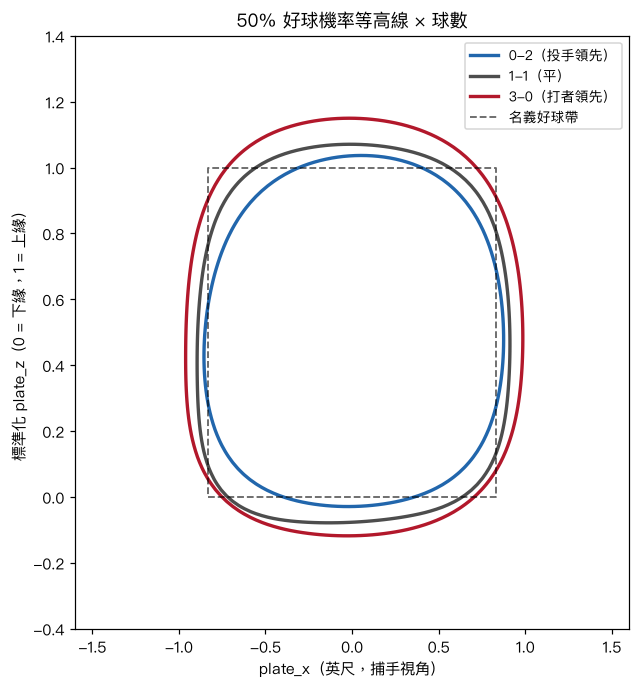
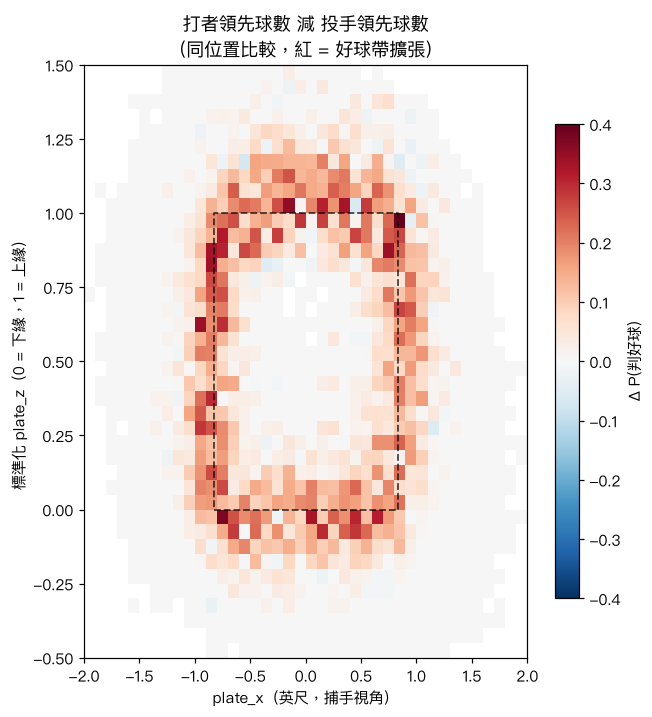
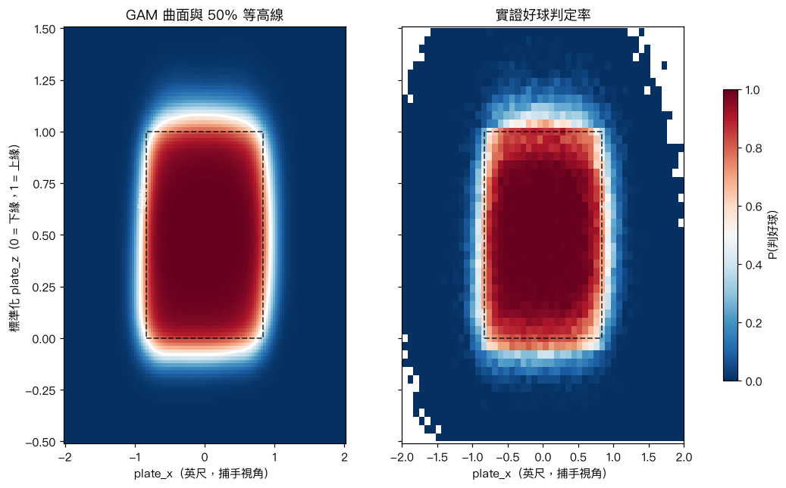
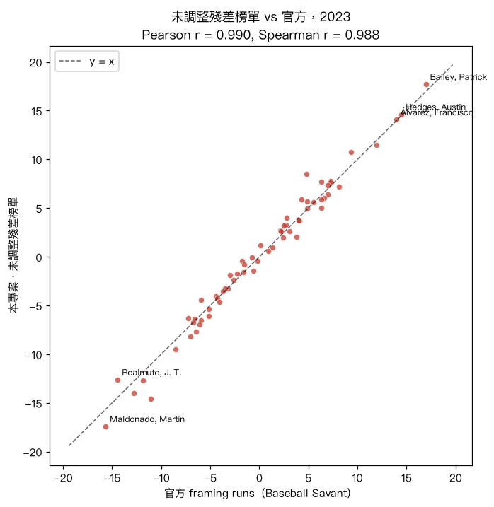
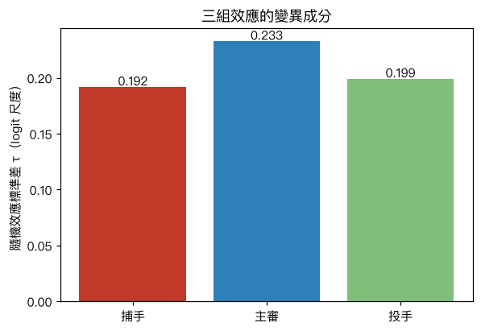
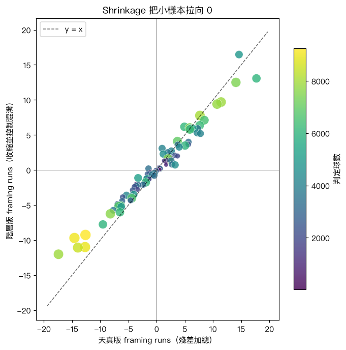
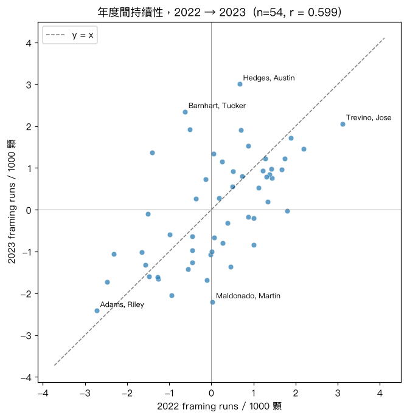
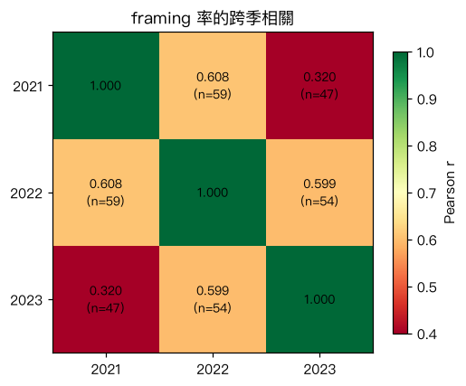
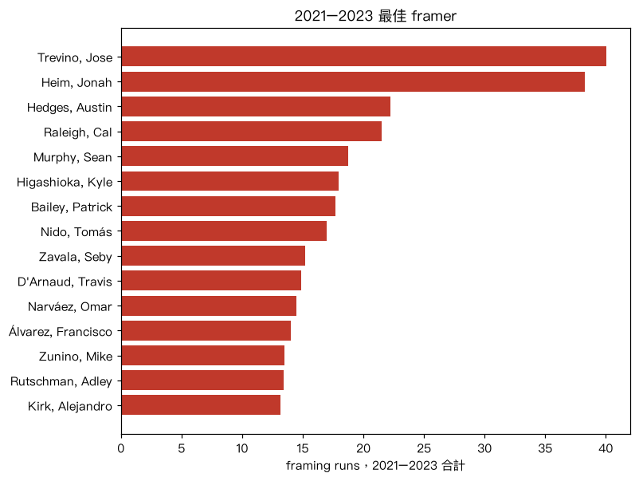
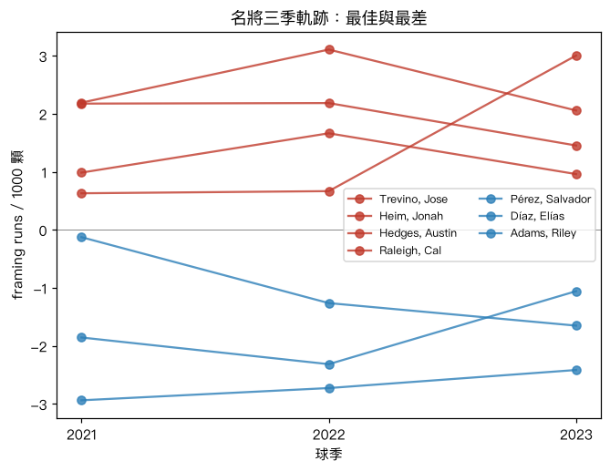

# MLB 捕手偷好球（Pitch Framing）價值量化

[English](README.md) | **繁體中文**

同樣位置的一顆球，有些捕手就是比較容易接成好球。這個專案要拆解的是：這個差距有多少與捕手本身有關，又有多少來自他搭配到的主審和投手。

做法是先用位置與情境（但**不含**捕手身分）建一個好球機率模型，把它的預測當成反事實基準——「換一個平均捕手來接，這裡會被判好球的機率是多少」——再把殘差當成第一版的 framing 數字。接著改用交叉隨機效應模型重估，讓捕手、主審、投手三組效應去爭奪同一份殘差，而不是全部落在捕手頭上。

資料是 2021–2023 例行賽的 106 萬顆判定球。未調整的殘差榜單與 Baseball Savant 公布的 framing runs 相關 r = 0.99。季內重現性很高（split-half r = 0.82，校正回整季長度是 0.90），跨季則維持在 r ≈ 0.60。

<p align="center">
  <br>
  <em>好球帶不是固定的：50% 好球機率等高線在 3-0 向外擴張、在 0-2 向內縮小。</em>
</p>

---

## 結果

### 1. 好球帶邊緣是模糊的，而且會隨球數移動

好球判定率在進壘位置上呈現一圈很寬的過渡帶。framing 只可能發生在這圈裡——正中央的球誰接都是好球，差一英尺的球誰接都是壞球。

球數會讓這圈移動。把位置固定住、比較打者領先與投手領先的球數，差異集中成好球帶邊緣的一圈光環，中央幾乎沒有差別：

<p align="center">
  
</p>

這件事對後面很關鍵：0-2 與 3-0 好球率的原始差距（8% vs 63%）大部分是進壘位置造成的假象，因為 3-0 的球本來就多半塞中間。只有控制位置之後，主審真正的球數偏誤才顯現出來。

### 2. 基準模型

一個 logistic GAM：`plate_x` × 標準化 `plate_z` 的二維張量光滑面，加上打者側、投手側、壞球數、好球數的加性項。2023 季 AUC 0.98，擬合曲面與實證曲面貼合到足以拿來當反事實基準。

<p align="center">
  
</p>

高度標準化用 `(plate_z − sz_bot) / (sz_top − sz_bot)`，把每位打者的好球帶壓到 0–1 尺度。有這一步，同一個曲面才能同時適用於 5'6" 的開路先鋒和 6'7" 的一壘手。

### 3. 未調整的 framing runs，與官方榜單對照

把每位捕手的 `實際 − 預測` 加總、乘上每顆偷來的好球 0.125 runs，做出來的榜單與 Baseball Savant 公布的數字非常接近：63 位合格捕手 r = 0.990、Spearman 0.988，兩端的名字也一樣。

<p align="center">
  
</p>

這裡有兩件事要講精確。

第一，這是**未調整的殘差榜單，不是階層模型**。它只控制了進壘位置與球數，沒有別的。第 4 節的階層估計是另一個量，這個相關係數並沒有驗證它。

第二，兩種方法的建構方式不同。Savant 說明其 framing runs 含**球場與投手調整**；完整模型未公開，對主審身分的處理也沒有文件說明。本專案在這個階段既沒做球場調整、也沒做投手調整。所以這份吻合說明的是位置模型校準良好、失分換算合理，也顯示那些調整並不太會改變榜單順序；它不能獨立佐證任何一方分離出了捕手的真實技術。

### 4. 階層模型

分兩階段，因為在百萬列上跑完整貝葉斯並不實際。第一階段凍結 GAM 的預測，第二階段對殘差放三組交叉隨機截距，讓它們互相競爭：

```
logit P(strike) = β0 + β1·logit(baseline) + θ_catcher + φ_umpire + ψ_pitcher
θ_catcher ~ N(0, τ_c²),  φ_umpire ~ N(0, τ_u²),  ψ_pitcher ~ N(0, τ_p²)
```

有意思的是變異成分。2023 季主審之間的差異（τ = 0.233）大於捕手之間（τ = 0.192），投手項（τ = 0.199）也和捕手差不多。在這個模型設定下，一顆邊緣球的判定，由「誰蹲主審」解釋的變異比「誰蹲捕手」更多。

<p align="center">
  
  
</p>

Shrinkage 的行為符合預期。判定球數 6,000 顆以上的正牌捕手保留約 85% 的原始數值；不到 500 顆的替補則不管原始數字多漂亮，都只剩下大約四分之一。合格捕手整體的離散度收斂到天真版的 82%，而且兩側一起收。天真估計誇大的是捕手之間的差距，並不是把所有人一律往上灌水。

這些是單一模型設定下的**關聯**，不是識別出來的因果效應。球種、球速、位移、打者身分、球場，以及捕手與投手並非隨機配對這件事，都還沒進模型。

### 5. 信度

把每位捕手 2023 的球隨機分成兩半再相關，得到 r = 0.82（50 次分半的平均）；用 Spearman–Brown 校正回整季長度是 R = 0.90。跨季方面，2022 預測 2023 的相關是 r = 0.599。

這兩個數字都是用未調整的殘差率算的，不是階層估計，這樣半季與單季才能直接比較，也不必每次重跑混合模型。

<p align="center">
  
</p>

### 6. 三季

合併 2021–2023 讓每位捕手的數字更穩（Jose Trevino 三季合計 +40 runs 居冠），也補齊了持續性的全貌。連續兩季平均相關 0.603，隔一年則掉到 0.320。這個衰減很接近單純 AR(1) 過程的預測（0.603² = 0.364），所以 framing 看起來不像固定不變的特質，比較像每年會微幅漂移的東西。

<p align="center">
  
  
</p>

<p align="center">
  <br>
  <em>最強的 framer 三季都在零線之上，最差的三季都在零線之下。</em>
</p>

階層模型也在全部 104 萬列建模資料上重跑，效應跨三季共享，給出全專案最穩定的單一捕手估計。三組變異成分在這裡趨於接近（τ ≈ 0.18–0.19），主審仍然最大。

### 2023 排行榜（階層模型）

| 捕手 | 判定球數 | Framing runs |
|---|--:|--:|
| Austin Hedges | 4,865 | +16.5 |
| Patrick Bailey | 6,038 | +13.1 |
| Francisco Álvarez | 7,430 | +12.5 |
| Jonah Heim | 7,870 | +9.7 |
| William Contreras | 7,802 | +9.4 |
| … | | |
| Elías Díaz | 8,462 | −11.1 |
| Keibert Ruiz | 8,926 | −11.0 |
| Martín Maldonado | 7,891 | −12.0 |

以大約 10 runs 換算 1 勝來看，最好與最差之間差了將近三勝，而這些完全不會出現在傳統的成績單上。

---

## 方法總覽

| 階段 | 內容 | Notebook / 模組 |
|---|---|---|
| 資料管線 | 按月抓 Statcast、只留判定球、標準化 `plate_z`、存 parquet | [`data/fetch.py`](data/fetch.py) |
| EDA | 2D 好球判定率熱圖、球數效應 | [`notebooks/01_eda.ipynb`](notebooks/01_eda.ipynb) |
| 基準模型 | Logistic GAM 好球機率曲面 | [`models/baseline_gam.py`](models/baseline_gam.py), [`02_gam_baseline.ipynb`](notebooks/02_gam_baseline.ipynb) |
| Framing runs | 未調整殘差 runs、與官方榜單對照 | [`models/framing_runs.py`](models/framing_runs.py), [`03_framing_runs.ipynb`](notebooks/03_framing_runs.ipynb) |
| 階層模型 | 捕手／主審／投手交叉隨機效應、shrinkage | [`models/hierarchical.py`](models/hierarchical.py), [`04_hierarchical.ipynb`](notebooks/04_hierarchical.ipynb) |
| 信度分析 | split-half、年度間相關 | [`models/reliability.py`](models/reliability.py), [`05_reliability.ipynb`](notebooks/05_reliability.ipynb) |
| 三季擴充 | 合併榜單、持續性矩陣、名將軌跡 | [`06_multiseason.ipynb`](notebooks/06_multiseason.ipynb) |

逐球資料透過 `pybaseball` 取自 Statcast。主審不在 Statcast 裡，所以改用 MLB Stats API 逐場抓、以 `game_pk` join。對照用的官方榜單則是從 Baseball Savant 取得——`pybaseball.statcast_catcher_framing` 目前壞掉，而舊的 CSV 端點會默默忽略 `year` 參數（不論哪一年都回傳同一份資料），因此 [`data/official.py`](data/official.py) 改為解析榜單頁面內嵌的 JSON。

範圍是 2021–2023 例行賽（`game_type == 'R'`，排除春訓與季後賽），只留判定球（`called_strike` / `ball`）：共 106 萬顆，其中 104 萬顆通過限制段提到的座標修剪。2026 年起刻意排除——ABS 挑戰制度自該季起在大聯盟實施，它並沒有取代人類判定，但確實改變了 framing 這個數字的意義。

---

## 重現

環境用 [uv](https://docs.astral.sh/uv/) 管理：

```bash
uv sync

# 1. 逐球資料，一季一季抓（原始月檔會快取）
uv run python -m data.fetch --season 2021
uv run python -m data.fetch --season 2022
uv run python -m data.fetch --season 2023

# 2. 各季基準 GAM → data/processed/statcast_<year>_baseline.parquet
uv run python -c "from models.baseline_gam import build_baseline_parquet as b; [b(y) for y in (2021,2022,2023)]"

# 3. 各季主審
uv run python -c "from data.umpires import fetch_umpires as f; [f(y) for y in (2021,2022,2023)]"

# 4. 階層模型
uv run python -m models.hierarchical         # 單季（2023）
uv run python -m models.hierarchical multi   # 三季合併 2021–2023

# 5. 依序執行 notebook（01–03 需要步驟 2；04 需要步驟 3–4；06 需要三季都齊）
for nb in 01_eda 02_gam_baseline 03_framing_runs 04_hierarchical 05_reliability 06_multiseason; do
  uv run jupyter nbconvert --to notebook --execute notebooks/$nb.ipynb --inplace
done

# 6. README 用圖（中英兩套）
uv run python make_figures.py

uv run pytest -q
```

執行時間大致是：每季抓取 15–20 分、每季基準 GAM 約 2 分、單季階層模型幾分鐘、三季合併約一小時。每一步都會快取，所以只有第一次跑會慢。

資料檔、模型快取、notebook 自己輸出的圖都不進版控（見 `.gitignore`），上面的指令可以全部重生。README 內嵌的圖則收在 [`docs/images/`](docs/images/) 並進版控，由 [`make_figures.py`](make_figures.py) 產生而非 notebook，好讓中英兩版各自帶自己語言的標籤。

## 專案結構

```
data/
  fetch.py         月別 Statcast 抓取、清理、標準化
  umpires.py       每場主審（MLB Stats API）
  official.py      Baseball Savant 官方 framing 榜單（對照用）
models/
  baseline_gam.py  第一層 GAM 好球判定基準模型
  framing_runs.py  未調整殘差 framing runs、官方對照
  hierarchical.py  兩階段交叉隨機效應模型
  reliability.py   split-half 與年度間信度
notebooks/         01_eda … 06_multiseason
tests/             管線不變量檢查（pytest）
make_figures.py    重生 docs/images 的中英兩套圖
docs/images/       en/ 與 zh/，兩份 README 各自使用
archive/           動工前的研究計畫，已被本 README 取代
```

## 限制

- **這是關聯，不是因果。** 混合模型控制了進壘位置、球數、打者側、投手側，以及捕手、主審、投手三者的身分。它沒有納入球種、球速、位移、打者身分與球場，而且捕手與投手並非隨機配對。捕手項應該讀作「在這個模型設定下與捕手相關的變異」。
- 混合模型用變分貝葉斯（statsmodels）擬合，會跑到預設迭代上限而未完全收斂。固定效應與變異成分在不同子樣本、不同種子下都穩定，合成資料檢查也能正確還原已知的變異成分（[`tests/test_random_effects.py`](tests/test_random_effects.py)），但用 R 的 `glmmTMB` 做 MLE 會是更紮實的版本。
- 球數在基準模型裡是加性項，只會平移好球帶、不會改變它的形狀。形狀改變是真實存在的（見前面的等高線圖），也用各球數分別擬合呈現了，但它並沒有進到產生 framing 數字的那個模型裡。
- 建模前會剔除 |plate_x| > 2.5 英尺、或標準化高度落在 [−1, 2] 之外的球，避免 spline 外插不穩：大約 2% 的球，其中 2023 季 7,386 顆裡只有 1 顆是好球，幾乎不帶 framing 訊號。
- 判定球數少的投手併成一組以維持混合模型可解（單季 < 100 顆、三季合併 < 150 顆）。這些投手的個別效應本來也會收縮到接近 0。
- Run value 固定用每顆好球 0.125 runs。真實價值其實隨球數變化——偷到第三個好球遠比偷到第一個壞球值錢——所以每位捕手的總計是近似值。


## 參考文獻

- [Pavlidis, H. & Brooks, D. (2014). *Framing and Blocking Pitches: A Regressed,Probabilistic Model*. Baseball Prospectus.](https://www.baseballprospectus.com/news/article/22934/)
- [Judge, J., Pavlidis, H. & Brooks, D. (2015). *Moving Beyond WOWY: A Mixed Approach to Measuring Catcher Framing*. Baseball Prospectus.](https://www.baseballprospectus.com/news/article/25514/)
- [Albert, J. (2023). *Called Strikes*.](https://bayesball.github.io/BLOG/Called_Strikes.html)
- Deshpande & Wyner (2017), *A Hierarchical Bayesian Model of Pitch Framing*, JQAS.
- Judge, Pavlidis & Brooks (Baseball Prospectus), *Moving Beyond WOWY*.
- [Baseball Savant catcher framing leaderboard](https://baseballsavant.mlb.com/catcher_framing)（方法說明）。

## 技術棧

Python 3.12 · polars · pandas · pybaseball · pyGAM · statsmodels · scikit-learn · matplotlib · uv
