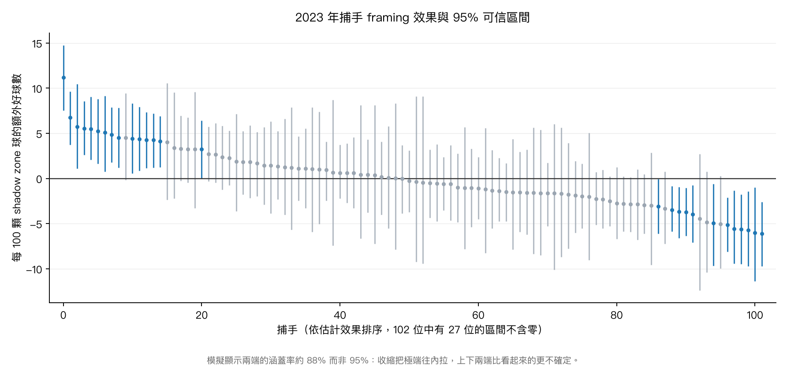
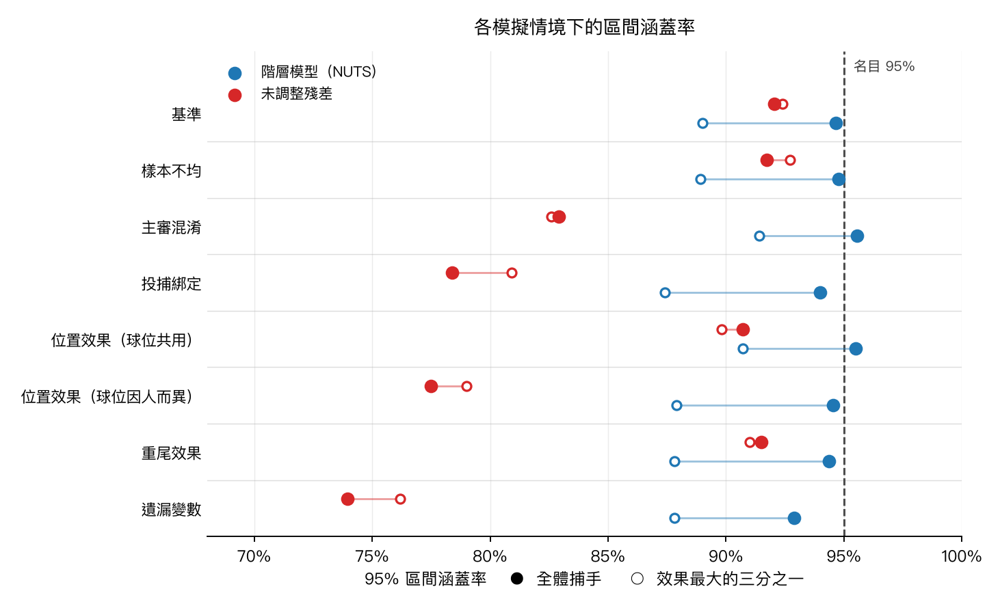
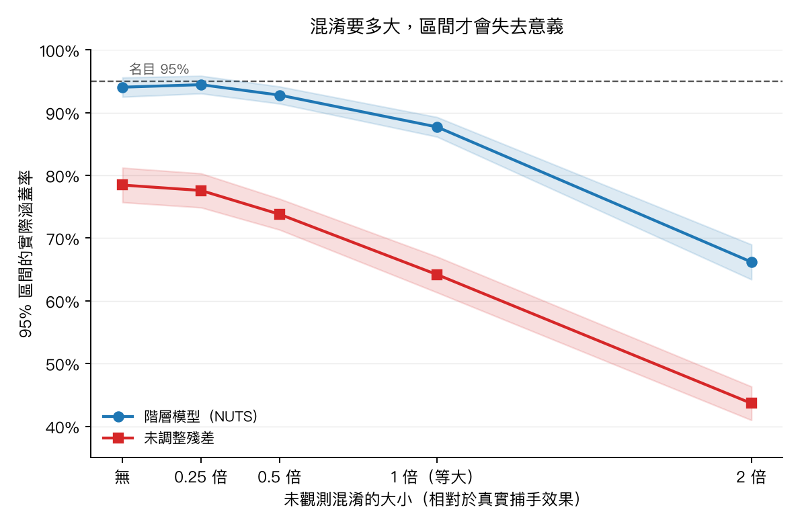

# 捕手偷好球（Pitch Framing）的量化

[English](README.md) | **繁體中文**

這個專案是從一集 podcast 開始的——一位在 MLB 球團工作的台灣資料科學家提到，捕手 framing 是他進去之後接到的第一個專案。所以我也試著做做看。

同樣位置的一顆球，不同捕手接，主審判好球的機率不同。這個專案的第一版建了一個模型去量它：用進壘位置與情境擬合好球機率曲面，不放捕手身分，把預測值當成「同樣描述的一顆球該有的期望」，再讓捕手、主審、投手三組效應去競爭同一份殘差。產出是一份榜單、三個變異成分，以及與 Baseball Savant 公布數字之間 0.990 的相關。

這一版問的是另一件事：那些數字，撐得住第一版對它們下的結論嗎？

有兩個撐不住，而且原因相同——第一版的每一個數字都是點估計，沒有附區間，也沒有任何東西檢驗過這個估計式值不值得相信。

---

## 改了什麼

原本的分析沒有被改寫，仍然可以在 [`v1.0`](../../tree/v1.0) tag 取得。四個具體宣稱被拿來檢驗：

| v1 的宣稱 | 結果 |
|---|---|
| 主審之間的變異大於捕手之間（τ 0.233 對 0.192） | **不成立。** 在 2023 上重現（P = 0.81），但在季別之間會翻面、隨 shadow zone 門檻移動，而且從未強到可以當成事實陳述 |
| 榜單能區分捕手 | **部分成立。** 63 位合格捕手中有 23 位的區間不含零，但多數相鄰名次分不出勝負 |
| 對 Savant 的 r = 0.990 說明位置模型是對的 | **對，但它說明的比看起來少**——這個相關係數對估計式的品質幾乎完全不敏感 |
| 產生這一切的變分擬合沒有收斂 | **無害。** NUTS 重現到小數第四位 |

最後一列是我開這一輪的原因。結果它是唯一沒問題的那一條。

---

## 資料與設計

2021–2023 例行賽，只取主審判定球（`called_strike` / `ball`）：106 萬顆，剔除極端座標後 104 萬顆。逐球資料來自 Statcast（`pybaseball`），主審來自 MLB Stats API，以 `game_pk` join。2024 之後不在範圍內；2026 是刻意排除的——ABS 挑戰制那年上路，framing 這個數字的意義隨之改變。

有三個設計決定承擔了大部分的重量。

基準機率一律樣本外。framing 的訊號是「實際 − 預測」。如果預測來自一個看過這顆球的模型，殘差會被擬合本身壓平一部分。這裡每一顆球的基準機率都來自沒看過它的模型：2021–2022 用依 `game_pk` 分割的五折 cross-fitting，2023 則用只在 2021–2022 上擬合的模型。

分析限定在 shadow zone——這裡指的是**模型定義**的帶狀區域，也就是基準模型給出 0.2 < p̂ < 0.8 的球，不是 Statcast 那個以好球帶邊緣內外各一顆球寬度劃出的幾何 Shadow Zone。judgement 有疑義的地方才輪得到 framing。這個帶狀區域佔判定球的 14.5%，卻帶有關於捕手效果的 60.8% Fisher information——資訊量正比於 p(1−p)，正中好球帶的球幾乎不帶資訊。標準誤只放大 1.27 倍，不是球數比暗示的 2.6 倍。

2023 在 v2 的整個開發期間鎖起來，只花用一次。模型形式、門檻、推論引擎、估計目標、要報哪些數字，全部在 2021–2022 上決定完畢才動它，最後才用那麼一次，為的是讓新數字能和 v1 發表的 2023 表格在同一季上並排。它是**鎖定的評估集，不是未見過的 holdout**：v1 分析過 2023 也在上面發表過榜單，而要跟那張表對照正是這一輪花掉這一季的理由。這個紀律買到的是「沒有任何 v2 的決定是對著 2023 調出來的」；它買不到的是「2023 沒被看過」。

---

## 結果

### 1. 好球帶的邊緣是軟的，而且隨球數移動

好球判定率在本壘板上呈現一條寬的轉換帶。那條帶是 framing 唯一能起作用的地方——正中的球誰接都是好球，偏出一英尺的球誰接都是壞球。

<p align="center">
  <br>
  <em>50% 好球機率等高線在 3-0 擴張、在 0-2 收縮。</em>
</p>

球數會移動那條帶。把打者領先與投手領先的球數在相同位置上相比，差異集中成好球帶邊緣的一圈，中間幾乎沒有：

<p align="center">
  
</p>

0-2 與 3-0 之間未經調整的好球判定率差距（8% 對 63%）主要是球位造成的假象，因為 3-0 的球本來就往中間投。只有在固定球位之後，主審真正的球數偏好才顯現出來。

這一節沿用 v1，未經改動，也仍然是整個專案裡最清楚的一件事。

### 2. 誠實評分之後的基準模型

模型形式與 v1 相同——`plate_x` 與標準化 `plate_z` 的張量光滑面，加上打者側、投手側、壞球數、好球數的加性項——在 2021–2022 的訓練分割上重新擬合，並在樣本外評分。

| | Log loss |
|---|--:|
| 訓練集（樣本內） | 0.17346 |
| 驗證集（樣本外，依場次分割） | 0.17149 |

差距是零。410 個基底對上 55 萬列資料再加懲罰項，根本沒有過擬合的空間。v1 報告樣本內指標是方法上的瑕疵，但它沒有讓任何數字失真——只有一個例外，見第 3 節。

校準是另一回事。在樣本外，模型在 p̂ = 0.5 以下高估好球機率、以上低估，整個 shadow zone 偏離一到兩個百分點。這個 S 形是真的——10 萬顆樣本外的球上，六個分箱單調偏移——但重新校準之後，榜單首尾的位移只有 0.32 runs，而榜單本身的全距是 28.5。真實，但不值得處理。

### 3. r = 0.990 說明了什麼，又沒說明什麼

v1 的頭號驗證，是它的未調整榜單與 Savant 公布 framing runs 之間的相關。這個相關現在可以拆開（2023）：

| 設定 | 對 Savant 的 r |
|---|--:|
| v1：未調整殘差、全部判定球、**樣本內**基準 | **0.990** |
| 未調整殘差、全部判定球、樣本外基準 | 0.958 |
| 未調整殘差、僅 shadow zone、樣本外 | 0.936 |
| 階層模型、shadow zone、樣本外 | 0.942 |

由上往下讀：拿掉樣本內基準損失 0.032，限定 shadow zone 再損失 0.022，而把未調整估計式換成階層模型，增加 0.006。

第三項才是要緊的。第 6 節會顯示，在真實存在的混淆結構下，未調整估計式宣稱 95% 的區間實際只涵蓋 74%，而階層模型維持校準。把前者換成後者，對 Savant 的相關只動了千分之六。

所以這個相關不可能當作估計式站得住的證據：把估計式換成站得住的那一個，它幾乎不動。v1 的 README 當時已經寫了那不是獨立佐證。那份吻合反映的是方法相似，而其中一部分只不過是雙方都在所評分的那一季內做了樣本內擬合。

<p align="center">
  
</p>

### 4. 捕手、主審、投手——這次帶區間

模型就是 v1 的：基準 logit 當校準共變量進入第二階段，三組交叉隨機截距競爭殘差。引擎換成 NUTS（numpyro），跑在 shadow zone 子集上，隨機效果採非中心參數化。

這個共變量的係數是估計出來的，不是固定值——所以它不是 *offset*，offset 的定義正是係數依構造固定為 1。自由擬合的結果是 **1.089，95% 區間 [1.071, 1.107]**，完全不含 1。這份自由是有用的：它在隨機效果看到殘差之前，先吸收掉第 2 節那個校準 S 形的斜率成分。

把它釘回 1 再擬合一次，變的只有用語。每位捕手的 runs 相關 r = 0.9997，單一捕手最大位移 0.40 runs 對上 28.9 的全距，前十名還是同樣那十位，P(τ 主審 > τ 捕手) 從 0.4635 變成 0.4615。那個假設是錯的，而估計式並不依賴它——這是這個發現比較有用的版本，也比「榜單真的動了」無聊。跑在 train pool 上而不是 2023，因為 2023 已經花掉了（[`models/sensitivity.py`](models/sensitivity.py)、[`results/sensitivity_slope.csv`](results/sensitivity_slope.csv)）。

換引擎什麼都沒改變，本來也不會。在完全相同的資料上，兩種引擎對每位捕手效果的相關是 r = 0.9999，變分貝葉斯低估後驗標準差 5%。NUTS 提供的是後驗樣本，而下面那種機率非要它不可。

2023，也就是 v1 報告的那一季：

| | 後驗平均 | 89% 區間 |
|---|--:|---|
| τ 捕手 | 0.2001 | [0.169, 0.237] |
| τ 主審 | 0.2264 | [0.196, 0.261] |
| τ 投手 | 0.2019 | [0.168, 0.237] |

P(τ_主審 > τ_捕手) = 0.81。

v1 的順序重現了。但把同樣的擬合跑在每一季上：

| | P(τ_主審 > τ_捕手) |
|---|--:|
| 2021 | 0.88 |
| 2022 | 0.41 |
| 2023 | 0.81 |
| 2021–2022 合併 | 0.46 |

順序在 2021 和 2022 之間翻面，而且從未超過 0.88。v1 沒有算錯任何東西，它的數字重現得很好。它是把一件在手上三季中有一季是擲銅板的事情，當成關於棒球的發現寫了出來。

shadow zone 的門檻同樣會推動它。在合併的 train pool 上，事前承諾的三個帶狀區給出的 P(τ 主審 > τ 捕手) 分別是 0.50、0.46、0.63（[`results/sensitivity_threshold.csv`](results/sensitivity_threshold.csv)）。兩個任意的分析者選擇都能推動這個順序，而兩個都推不到能定案的程度——這比單靠跨季翻轉，更能支撐「不成立」這個判斷。

### 5. 捕手之間到底差多少

<p align="center">
  
</p>

灰色是區間蓋住零的，藍色是不蓋的。2023：

| 限制 | 捕手數 | 區間不含零 | 95% 分得出勝負的配對 |
|---|--:|--:|--:|
| 全部 | 102 | 27（26%） | 27% |
| ≥500 顆 shadow zone 球 | 49 | 20（41%） | 47% |
| ≥1000 顆 | 15 | 8（53%） | 55% |

在 Savant 列為合格的 63 位捕手中，23 位的區間不含零。

分布的兩端和零清楚地分開了，中段沒有，而且多數相鄰配對分不出勝負。在 2021–2022 上，前兩名更接近，P(第 1 名勝第 2 名) = 0.77。

工作計畫在圖存在之前就把這個結果列為可接受的結論，同時寫下三個 shadow zone 門檻全部報告的承諾；那份計畫在 [`archive/PLAN.md`](archive/PLAN.md)，日期在 commit 紀錄裡。

三個門檻現在都報了（[`results/sensitivity_threshold.csv`](results/sensitivity_threshold.csv)，以及 METHODS §2.3）。榜單幾乎不動——每位捕手的 runs 對主門檻的相關是 0.991 與 0.987——而主文用的那個門檻，既不是區間最窄的，也不是讓最多捕手脫離零的。從最寬到最窄，分得出來的捕手比例分別是 24.8%、23.0%、16.2%。

這張圖的圖說帶著本節其他部分帶不了的一句：模擬顯示兩端的涵蓋率約 88% 而非 95%。收縮把極端往內拉，而榜單就是給人看兩端的。

### 6. 拿已知真值檢驗估計式

所有能做的外部驗證，都是拿我的估計去比另一個我也不知道真值的東西。模擬是唯一真值由我設定、而非推論出來的地方——這也是為什麼這部分是整個專案裡不能砍的一步。

八個情境，在真實的球位與出賽量分布上生成已知的捕手、主審、投手效果，各重複 100 次，兩個估計式都以 bias、RMSE、涵蓋率、排名還原度評分。合成資料設計成小規模——30 位捕手、每人約 500 球。這是計算成本的取捨，也意味著涵蓋率數字不能當成整季樣本量下的精確值。

<p align="center">
  
</p>

未調整估計式恰好在有混淆的地方失準。它宣稱 95% 的區間，在主審混淆下涵蓋 83%、投捕綁定下 78%、遺漏一個與捕手相關的變數時 74%。沒有混淆的地方它表現正常。階層模型全程維持在 92.9% 到 95.6% 之間。

這八個情境裡有三個是專門為了打壞階層模型的假設而設計的——隨球位變化的捕手效果、違反常態先驗的重尾效果、遺漏變數——沒有一個成功。這比本專案原本想找的結論弱。它也比較好辯護。

真正撐不住的，是與捕手相關的未觀測混淆。與其挑一個混淆大小回報「會不會壞」，這裡把強度掃了一遍：

<p align="center">
  
</p>

混淆維持在被測效果的一半以內時，涵蓋率守得住；等大時掉到 88%；兩倍時 66%。v1 的 Limitations 用一句「捕手不是隨機分配給投手的」帶過，這張圖就是那句話加上數字。

還有一個沒預期到的發現，就是上圖中實心與空心標記之間的距離：效果最大的三分之一，其涵蓋率比整體低 3 到 6 個百分點，而且每一個情境都是，包括基準情境。未調整估計式沒有這個落差，因為它根本不收縮——它的問題是區間到處都太窄。

### 7. 外部驗證分不出來的東西

兩個估計式，跑在完全相同的球上，並排送進僅有的兩種外部驗證：

| 驗證 | 階層模型 | 未調整 | 「階層 − 未調整」的 95% CI |
|---|--:|--:|---|
| 跨季 2021 → 2022（46 位捕手） | 0.684 | 0.637 | [−0.007, +0.101] |
| 對 Savant，2021（59 位） | 0.892 | 0.914 | [−0.068, +0.014] |
| 對 Savant，2022（60 位） | 0.952 | 0.961 | [−0.027, +0.009] |

每一個區間都蓋住零。配對 bootstrap 重抽捕手，8,000 次；三列的差都朝同一個方向定義，所以每個區間都含得住自己那一列的差（[`models/validate.py`](models/validate.py)，輸出見 [`results/external_checks.csv`](results/external_checks.csv)）。

模擬能決定性地分開這兩個估計式——74% 對 93% 的涵蓋率。外部驗證完全分不開。以 46 到 60 位捕手的樣本，只有大於約 0.1 的相關係數差距才看得見，而實際差距沒有那麼大。

所以外部驗證做不到模擬在做的事。這也精確說明了 r = 0.990 為什麼從來就不是驗證：一個沒有能力分辨好壞估計式的檢查，無法告訴你手上的是哪一種。

### 8. 信度與持續性

沿用 v1，未經改動，而且仍然成立。把每位捕手的球隨機分半再相關，得到 r = 0.82（50 次分半的平均），用 Spearman–Brown 校正回整季長度是 R = 0.90；2022 預測 2023 的相關是 r = 0.599。這兩個數字用的都是未調整殘差率而非階層估計，如此半季與整季才能互相比較，不必每次重新擬合混合模型。

把 2021–2023 合併，每位捕手的數字更穩定——Jose Trevino 三年合計 +40 runs 居首——也補上了持續性的圖像。相鄰球季平均相關 0.603；相隔兩年降到 0.320，接近簡單 AR(1) 過程的預測（0.603² = 0.364）。framing 看起來不像固定特質，比較像一個每年會漂移一點的東西。

<p align="center">
  
  
</p>

<p align="center">
  <br>
  <em>最強的 framer 三年都在零以上，最弱的三年都在零以下。</em>
</p>

把階層模型重新擬合在全部 104 萬列建模資料上、效應跨季共享，給了 v1 全專案最穩定的單一捕手估計；三個變異成分在那裡收斂到 τ ≈ 0.18–0.19，主審名目上仍然最大。第 4 節就是那三個數字帶上區間之後的樣子。

---

## 2023 榜單

以 shadow zone 球數計算的 framing runs，附 95% 可信區間，並列 Savant 同季公布的數字。注意分母不同：這裡只計入判定有疑義的那 14.5% 的球。

| 捕手 | shadow 球數 | framing runs | 95% 區間 | Savant |
|---|--:|--:|---|--:|
| Austin Hedges | 791 | +11.1 | [+7.5, +14.6] | +14.5 |
| Francisco Álvarez | 1,088 | +9.2 | [+5.1, +13.1] | +14.0 |
| Patrick Bailey | 965 | +6.7 | [+3.1, +10.3] | +17.0 |
| Jason Delay | 633 | +4.4 | [+1.7, +7.1] | +6.6 |
| Victor Caratini | 640 | +4.2 | [+1.3, +7.1] | +7.2 |
| … | | | | |
| Jose Herrera | 418 | −2.9 | [−4.9, −0.7] | −4.1 |
| Riley Adams | 424 | −3.0 | [−5.0, −0.9] | −6.1 |
| Logan O'Hoppe | 540 | −4.1 | [−6.5, −1.7] | −6.4 |

榜首這幾個名字就是 v1 的名字——Hedges、Álvarez、Bailey 在 v1 的 2023 表格裡也是前段。改變的不是誰在榜上，而是這份榜單能承載多少信心：這 63 位裡有 40 位的區間包含零。

---

## 如果重做一次

我是為了錯的理由開這一輪的。v1 讓我不安的是它的階層模型用變分貝葉斯擬合而且沒有收斂。結果那是唯一沒問題的一件事。真正的缺口——整個專案沒有任何區間，也沒有任何東西檢驗過估計式值不值得相信——一直擺在明處，而我把它排在第二位。

我不只一次把雜訊讀成訊號。單一組 971 場的驗證分割產生了一個 p ≈ 0.03 的 shadow zone 偏誤；用全部 4,856 場做五折 cross-fitting 之後，那個偏誤消失了，而我當時距離為它重寫整條校準流程不到一小時。另一個情境在 10 次重複時看起來讓涵蓋率下降，跑到 100 次就回到名目值。兩次的共通點都是：那個數字指向我本來就想去的方向。

我有三個模擬情境什麼都沒測到。當每位捕手面對的球位分布都相同時，「隨球位變化的捕手效果」平均之後就退化成一個常數。定義在投手層級的遺漏變數，會被投手隨機效果整包吸收。學到的（用比較慢的方式）：動手寫生成程式之前，先想清楚擬合的模型會如何吸收你正要生成的東西。

量 JAX 程式的時間而不 block，量到的是派工不是計算。第一次的計時說 4 條鏈跑完只要兩秒。

以上每一件都連同日期與走錯的那一步，留在工作日誌裡。

下一步會想做的：ABS 挑戰制的年代。2026 在這裡被排除，因為生成過程變了；但「當規則在腳下改變時，一個 framing 數字會怎麼樣」是比這份文件裡任何問題都好的問題。

---

## 方法概覽

| 階段 | 內容 | 模組 |
|---|---|---|
| 資料管線 | 逐月抓取 Statcast、清理、標準化 | [`data/fetch.py`](data/fetch.py) |
| 切分 | 依 `game_pk` 切訓練／驗證，2023 保留 | [`models/splits.py`](models/splits.py) |
| 基準模型 | Logistic GAM，訓練集擬合、樣本外評分 | [`models/baseline_v2.py`](models/baseline_v2.py) |
| Cross-fitting | 訓練集的 out-of-fold 基準機率 | [`models/crossfit.py`](models/crossfit.py) |
| 階層模型 | 交叉隨機效應，NUTS 跑在 shadow zone | [`models/hierarchical_v2.py`](models/hierarchical_v2.py) |
| 引擎對照 | VB 對 NUTS、季別穩定性 | [`models/compare_engines.py`](models/compare_engines.py) |
| 區間 | Δ 後驗、成對比較機率 | [`models/intervals.py`](models/intervals.py) |
| 模擬 | 八情境、兩估計式、四指標 | [`sim/`](sim/) |
| 外部驗證 | 跨季、對照 Savant | [`models/validate.py`](models/validate.py) |
| 係數敏感度 | b 自由估計 vs 釘死在 1，跑在 train pool | [`models/sensitivity.py`](models/sensitivity.py) |
| Holdout | 2023，只用一次 | [`models/holdout.py`](models/holdout.py) |

v1 的模組（`baseline_gam.py`、`framing_runs.py`、`hierarchical.py`、`reliability.py`、notebooks 01–06）沒有被改動，仍然可以執行。

## 結果表

這份文件裡的每一個數字都可以追到 [`results/`](results/) 底下的一個 CSV，由 `uv run python make_results.py` 從模型快取寫出。那支程式不重新擬合任何東西；快取缺了就印出該跑哪一行指令，並跳過那張表。

| 檔案 | 撐住哪些數字 |
|---|---|
| [`leaderboard_2023_holdout.csv`](results/leaderboard_2023_holdout.csv) | 下面那份 2023 榜單——全部 102 位捕手的 Δ、framing runs、95% 區間與 Savant 數字 |
| [`leaderboard_2021_2022_train.csv`](results/leaderboard_2021_2022_train.csv) | 2021–2022 合併擬合的同一組欄位，148 位捕手 |
| [`leaderboard_v1_pooled_2021_2023.csv`](results/leaderboard_v1_pooled_2021_2023.csv) | v1 的三季合併 VB 榜單（第 8 節） |
| [`variance_components.csv`](results/variance_components.csv) | 第 4 節的 τ 表與 P(τ 主審 > τ 捕手) |
| [`separability.csv`](results/separability.csv) | 第 5 節的三個門檻，兩組擬合 |
| [`external_checks.csv`](results/external_checks.csv) | 第 7 節的相關與 bootstrap 區間 |
| [`sim_coverage.csv`](results/sim_coverage.csv) | 第 6 節的八情境 × 兩個估計式 |
| [`sim_confound_sweep.csv`](results/sim_confound_sweep.csv) | 混淆強度掃描 |
| [`sensitivity_slope.csv`](results/sensitivity_slope.csv) | 第 4 節的係數對照——自由擬合與 `b = 1` 並排 |
| [`sensitivity_slope_diff.csv`](results/sensitivity_slope_diff.csv) | 把 `b` 釘死在 1 之後榜單動了多少 |
| [`sensitivity_threshold.csv`](results/sensitivity_threshold.csv) | METHODS §2.3 承諾要報的三個 shadow zone 門檻 |
| [`v1_fit_summary.csv`](results/v1_fit_summary.csv) | v1 的固定效應，含估計出來的 `logit_base` 係數 |

## 重現

環境以 [uv](https://docs.astral.sh/uv/) 管理。v1 的流程未變動，指令見 [`v1.0`](../../tree/v1.0)。這一輪新增：

```bash
uv sync

# 2021–2022 的 out-of-fold 基準機率（約 20 分鐘，有快取）
uv run python -m models.crossfit

# 基準模型的樣本外評分
uv run python -m models.baseline_v2

# 後驗區間與成對比較
uv run python -m models.intervals

# 模擬：八情境 × 100 次重複（約 2 小時），然後是混淆強度掃描
uv run python -m sim.run 100
uv run python -m sim.run sweep 50

# 係數敏感度：b 自由 vs b=1，在 train pool 上擬合兩次（約 15 分鐘）
uv run python -m models.sensitivity

# 外部驗證，然後是 holdout
uv run python -m models.validate
uv run python -m models.holdout

uv run python make_figures_v2.py

# 這份 README 的每一張表，從上面的快取產生——不重新擬合
uv run python make_results.py
```

資料檔、模型快取與模擬輸出都不進版控；上面的指令會重新產生它們。

## 專案結構

```
data/
  fetch.py             逐月抓取 Statcast、清理、標準化
  umpires.py           每場的主審（MLB Stats API）
  official.py          Baseball Savant framing 榜單（對照用）
models/
  baseline_gam.py      v1 第一層 GAM 好球機率模型
  framing_runs.py      v1 未調整殘差 framing runs
  hierarchical.py      v1 兩階段交叉隨機效應模型（VB）
  reliability.py       分半與跨季信度
  splits.py            依場次切訓練／驗證，2023 保留
  baseline_v2.py       訓練集擬合、樣本外評分的基準模型
  crossfit.py          out-of-fold 基準機率
  hierarchical_v2.py   交叉隨機效應，NUTS 跑在 shadow zone
  compare_engines.py   VB 對 NUTS、季別穩定性
  intervals.py         後驗區間與成對比較機率
  identify.py          識別性診斷
  validate.py          跨季與 Savant 對照
  sensitivity.py       b 自由估計 vs 釘死在 1
  holdout.py           2023，只用一次
sim/                   模擬研究：生成、估計、執行
notebooks/             01_eda … 06_multiseason（v1）
tests/                 管線不變量檢查（pytest）
make_figures.py        v1 的圖，雙語
make_figures_v2.py     v2 的圖，雙語
make_results.py        每一張發表的表，從快取輸出成 CSV
results/               那些 CSV（進版控；快取本身不進）
docs/images/           en/ 與 zh/，兩份 README 使用的圖
archive/               兩輪的研究計畫，已被取代
```

## 限制

- **是關聯，不是因果。** 捕手項是「在這個模型設定下與捕手相關的變異」。第 6 節量化了未觀測混淆的後果：當一個與捕手相關的混淆與被測效果等大時，涵蓋率掉到 88%，兩倍時 66%。資料本身無法排除這種可能。
- **兩端的涵蓋率約 88% 而非 95%**，每一個模擬情境皆然。榜單的頭尾比區間看起來的更不牢靠。
- 模擬用的是 30 位捕手、每人約 500 球。涵蓋率數字不能直接當成整季樣本量下的精確值。
- 球種、球速、位移、打者身分、球場都沒有進模型。Savant 有做球場與投手調整，這裡沒有。
- 球數在基準模型中是加性項，只平移好球帶而不改變其形狀。改變形狀的效應是真實的，也用分球數各自擬合展示過，但它不在產生 framing 數字的那個模型裡。
- |plate_x| > 2.5 英尺、或標準化高度落在 [−1, 2] 之外的球，在建模前剔除，以免樣條外插：約佔 2%，其中 2023 年的 7,386 顆裡只有 1 顆是好球判定。它們幾乎不帶 framing 訊號。
- 判定球數少的投手併成一組以控制 level 數（單季擬合 < 100 顆，合併擬合 < 150 顆）。他們的個別效應無論如何都會收縮到接近零。
- Run value 沿用 v1 的固定 0.125。真實價值取決於球數——偷到第三個好球遠比偷到第一個壞球值錢——所以每位捕手的總計是近似值。改成隨球數變動只會等比例縮放榜單，不改變任何統計結論。
- holdout 紀律是有代價的：2023 被保留，所以跨季穩定性只剩一組年度配對，沒有衰減曲線。
- 基準模型在 shadow zone 有輕微校準偏差（第 2 節）。修正它會讓榜單移動約全距的 1%。

## 參考文獻

- [Pavlidis, H. & Brooks, D. (2014). *Framing and Blocking Pitches: A Regressed,Probabilistic Model*. Baseball Prospectus.](https://www.baseballprospectus.com/news/article/22934/)
- [Judge, J., Pavlidis, H. & Brooks, D. (2015). *Moving Beyond WOWY: A Mixed Approach to Measuring Catcher Framing*. Baseball Prospectus.](https://www.baseballprospectus.com/news/article/25514/)
- [Albert, J. (2023). *Called Strikes*.](https://bayesball.github.io/BLOG/Called_Strikes.html)
- Deshpande & Wyner (2017), *A Hierarchical Bayesian Model of Pitch Framing*, JQAS.
- [Baseball Savant catcher framing leaderboard](https://baseballsavant.mlb.com/catcher_framing)（方法說明）。

## 技術堆疊

Python 3.12 · polars · pandas · pybaseball · pyGAM · statsmodels · numpyro/JAX · scikit-learn · matplotlib · uv
