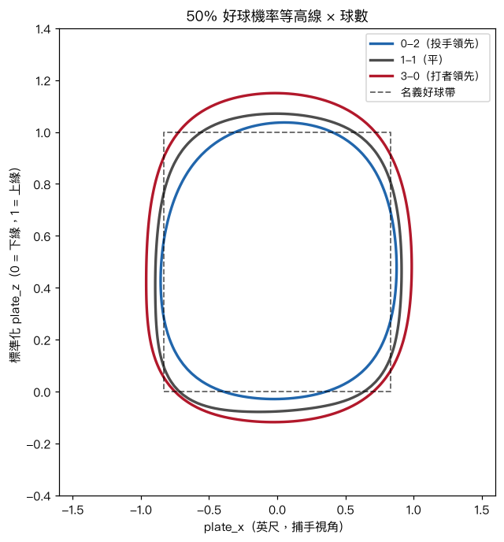
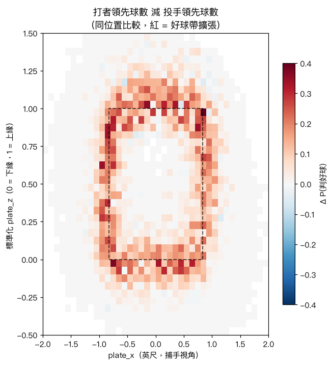
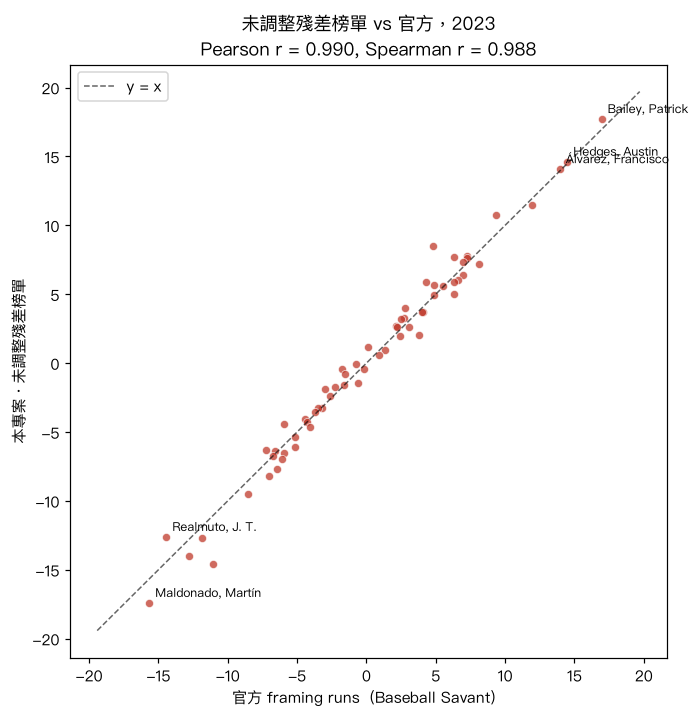
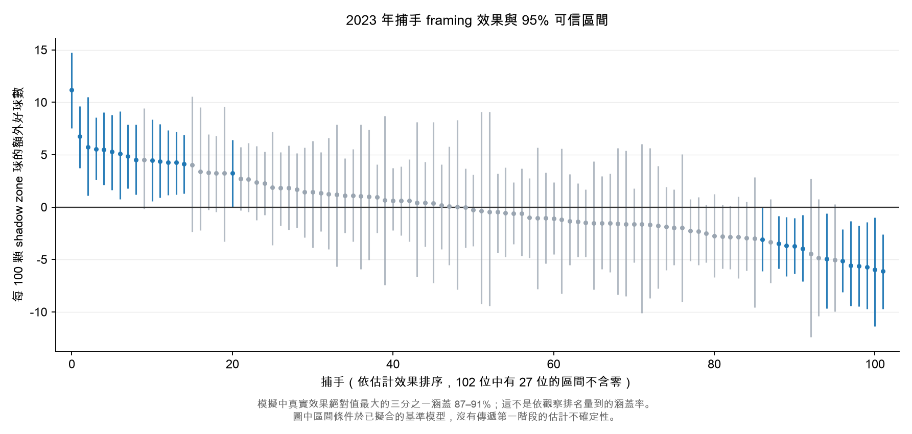
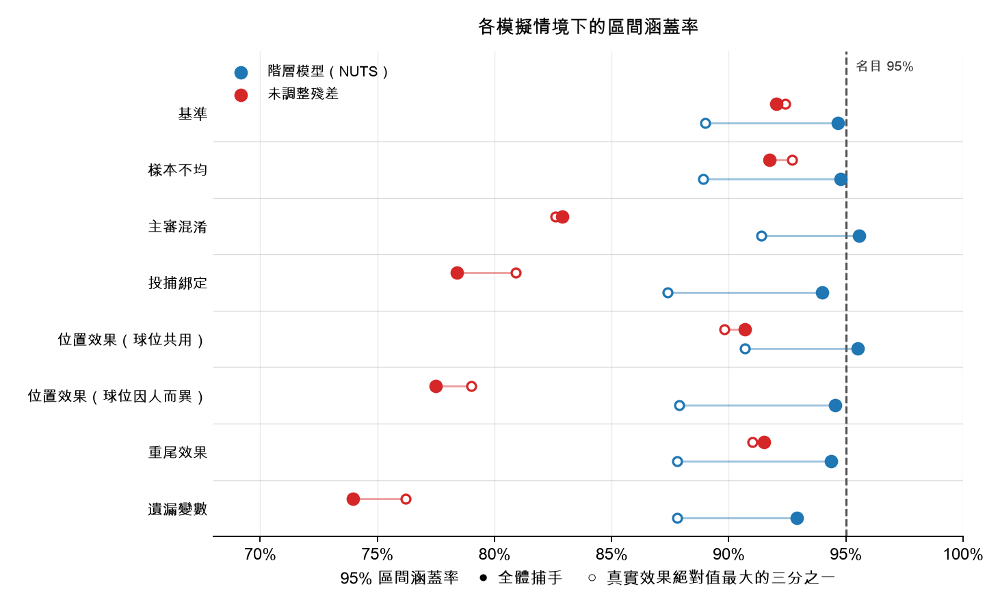
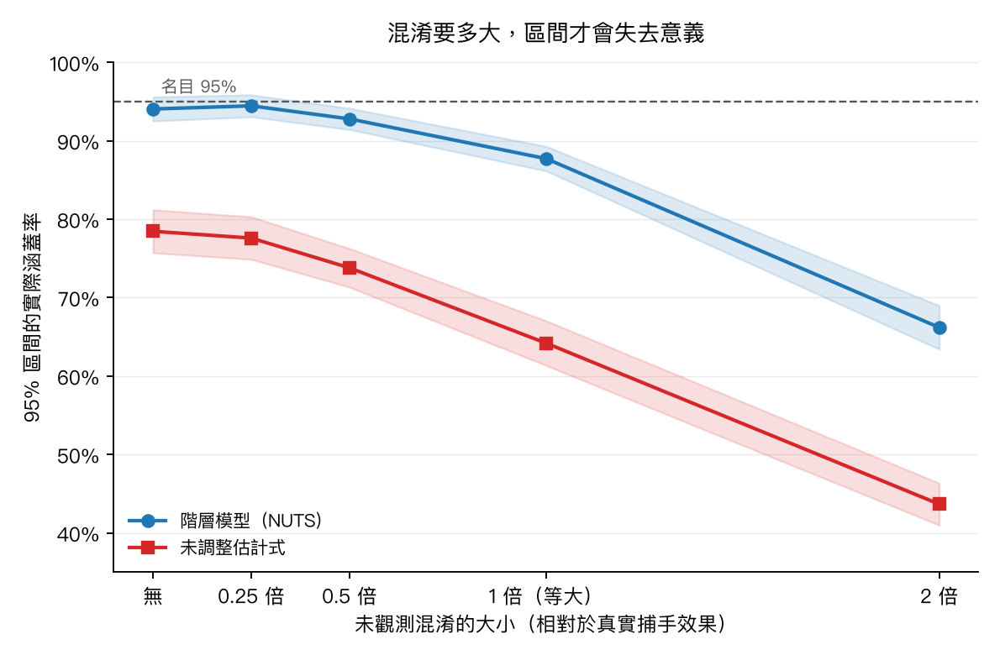

# MLB 捕手偷好球（Pitch Framing）價值量化

[English](README.md) | **繁體中文**

這個專案是從一集 podcast 開始的——一位在 MLB 球團工作的台灣資料科學家提到，捕手 framing 是他進去之後接到的第一個專案。所以我也試著做做看。

同樣位置的一顆球，有些捕手就是比較容易接成好球。這個專案的第一版分兩步量這件事：先用進壘位置與情境（但不含捕手身分）建一個好球機率模型，把它的預測當成「這樣一顆球該被判成什麼」的基準；再讓捕手、主審、投手三組效應去爭奪同一份殘差。產出是一份榜單、三個變異成分，以及與 Baseball Savant 公布的 framing runs 之間 0.990 的相關。

第二版檢查的是：這些數字撐不撐得住第一版對它們下的結論。變異成分的大小順序撐不住，榜單只撐得住一部分。兩者的原因相同：v1 的每一個數字都是點估計，沒有附區間；它唯一的合成資料測試，檢查的是效應有沒有對到正確的組別，而不是估計式本身的表現。那個相關係數撐得住，但它說明的比看起來少。

---

## 改了什麼

原本的分析沒有改動，仍然可以在 [`v1.0`](../../tree/v1.0) tag 取得。這一輪檢驗了 v1 說過或依賴的四件事。

| v1 | 結果 |
|---|---|
| 主審之間的變異大於捕手之間（τ 0.233 對 0.192） | **不成立。** 在 2023 上重現（P = 0.81），五季中有四季偏向同一邊，但 2022 翻轉、會隨 shadow zone 門檻移動，而且沒有一季到 0.95 |
| 榜單只憑點值替捕手排名 | **部分成立。** 63 位合格捕手中有 23 位的區間不含零；多數相鄰名次和擲銅板差不多 |
| 對 Savant 的 r = 0.990 說明位置模型沒問題 | **結論成立，但證明它的是第 2 節，不是這個相關。** 0.990 取決於基準模型抓對這一季的整體好球率，重估一個截距就能回到 0.989；而且這個相關看不到區間校準，而那正是兩個估計式差最多的地方 |
| 這一切背後的變分擬合沒有收斂 | **無害。** 在同一份 2022 資料上改用 NUTS 擬合，每位捕手的效果與 VB 的相關是 r = 0.9999 |

最後一列是我開這一輪的原因，結果它並不重要。

---

## 資料與設計

2021–2023 例行賽，只取判定球（`called_strike` / `ball`）：106 萬顆，剔除極端座標後剩 104 萬顆。逐球資料透過 `pybaseball` 取自 Statcast；主審來自 MLB Stats API，以 `game_pk` join。2024 與 2025（71 萬顆判定球）是 v2 定案之後才加入的兩個評估季，不進訓練資料。2026 年是刻意排除在 v2 之外的：ABS 挑戰制度自該季上路，改變了 framing 這個數字的意義。後記另外處理這一季。

有三個設計決定最要緊。

**基準機率一律樣本外。** framing 的訊號是「實際 − 預測」。如果預測來自在同一批球上擬合的模型，殘差會被擬合本身壓平一部分。這裡每一顆球的基準機率都來自沒看過它的模型：2021–2022 用依 `game_pk` 分割的五折 cross-fitting，2023–2025 則用只在 2021–2022 上擬合的模型。

**分析限定在 shadow zone。** 這裡指的是模型定義的帶狀區域，也就是基準模型給出 0.2 < p̂ < 0.8 的球；不是 Statcast 那個以好球帶邊緣內外各一顆球寬度劃出的幾何 Shadow Zone。framing 只可能發生在判決有疑義的地方，數字也支持這一點。以 v1 的基準模型在 2023 上量，這個帶狀區域只佔判定球的 14.5%，卻佔了捕手效果 60.8% 的 Fisher information，因為資訊量正比於 p(1−p)，正中央的球幾乎不帶資訊。（用 v2 的基準模型，帶狀區域佔 15%。）標準誤只放大 1.28 倍，不是球數比例暗示的 2.6 倍（[`results/shadow_information.csv`](results/shadow_information.csv)）。

**2023 在 v2 期間全程鎖住，模型只擬合一次。** 模型形式、門檻、推論引擎、估計目標，以及要報告哪些數字，全部在 2021–2022 上定案之後才碰 2023。階層模型只在最後對它擬合了一次，為的是讓新數字能和 v1 發表的 2023 表格對照。之後的診斷讀了這次擬合的後驗，也在 2023 的球上評估過基準模型，但沒有重擬模型，也沒有影響任何選擇（METHODS §2.4）。所以它是鎖定的評估集，不是從沒碰過的 holdout：v1 早就分析過 2023 並發表了結果，而那張表正是這一輪要用這一季的理由。鎖住的意思是 v2 沒有任何決定是對著 2023 調出來的，但這不代表 2023 沒被看過。2024 和 2025 是所有決定都做完之後才抓的，所以更乾淨，也各自走同一條路擬合一次。

---

## 結果

### 1. 好球帶邊緣是模糊的，而且會隨球數移動

好球判定率在進壘位置上呈現一圈很寬的過渡帶。framing 只可能發生在這圈裡：正中央的球誰接都是好球，差一英尺的球誰接都是壞球。

   
  <em>50% 好球機率等高線在 3-0 向外擴張、在 0-2 向內縮小。</em>

球數會讓這圈移動。把位置固定住、比較打者領先與投手領先的球數，差異集中在好球帶邊緣的一圈，中央幾乎沒有差別：

  

0-2 與 3-0 好球率的原始差距（8% vs 63%）大部分是進壘位置造成的假象，因為 3-0 的球本來就多半塞中間。只有控制位置之後，主審真正的球數偏誤才顯現出來。

這一節沿用 v1，沒有改動。

### 2. 基準模型，改在樣本外評分

模型形式和 v1 相同：`plate_x` × 標準化 `plate_z` 的二維張量光滑面，加上打者側、投手側、壞球數、好球數的加性項。這一版在 2021–2022 的訓練分割上重新擬合，並用沒參與擬合的場次評分。

| | Log loss |
|---|--:|
| 訓練集（樣本內） | 0.17346 |
| 驗證集（樣本外，依場次分割） | 0.17149 |

在這次的切分上，兩者的整體 log loss 看不出明顯落差（約 410 個基底對 55 萬列資料，另有懲罰項）。所以 v1 報告樣本內指標是方法上的瑕疵，但沒有明顯墊高它的擬合指標。這比「v1 的估計都沒受影響」窄：除此之外唯一的檢查是第 3 節對 Savant 的相關，在那裡重估基準模型的截距就能補回大部分差距。

校準比較弱。在樣本外，模型在 p̂ = 0.5 以下高估好球機率、以上低估，整個 shadow zone 偏離 0.7 到 1.6 個百分點。這個模式在 10 萬顆樣本外的球上很一致：0.5 以下的三個分箱都高估，以上的三個都低估。不過它對結果影響不大。重新校準之後，每位捕手 runs 的位移前後只差 0.32 runs，而同一批 84 位捕手的全距是 31.5 runs，所以基準模型就維持原樣。

這個模型之後沒有重擬。到了 2025，它把整體好球率高估了 2.6 個百分點；第 7 節說明這個漂移從哪裡來，以及它對未調整估計式造成什麼影響。

### 3. r = 0.990 說明了什麼，又沒說明什麼

v1 主要的外部檢查，是未調整榜單與 Savant framing runs 之間的相關。現在可以在 2023 上把這個相關拆開來看（[`results/savant_decomposition.csv`](results/savant_decomposition.csv)）：

| 設定 | 對 Savant 的 r |
|---|--:|
| v1：未調整殘差、全部判定球、**樣本內**基準 | **0.990** |
| 未調整殘差、全部判定球、樣本外基準 | 0.958 |
| 同上，但在 2023 上重估基準模型的截距 | 0.989 |
| 未調整殘差、僅 shadow zone、重估截距 | 0.960 |
| 階層模型、shadow zone、樣本外 | 0.942 |

改用樣本外基準少了 0.032；只在 2023 上重估一個數字，也就是基準模型的截距，相關就回到 0.989。樣本外基準把 2023 的整體好球率高估了 0.8 個百分點，而未調整的 framing runs 沒有截距，整季的偏移會變成一項跟上場量成正比的東西（第 7 節）。所以 v1 的樣本內基準與樣本外基準之間的差別，大部分是這一季的整體好球率，而 Savant 推測也是在季內擬合，同樣抓對了這個數字。2024 與 2025 也一樣：重估截距之後，未調整估計式對 Savant 的相關是 0.990 與 0.988。

接著限定 shadow zone 少了 0.029，換成階層模型再少 0.018。最後這一步才是重點，因為兩個估計式差最多的地方，這個相關看不到。在有混淆的情境下，未調整估計式宣稱 95% 的區間實際只涵蓋到 74%，階層模型則維持在 92.9% 到 95.6%；點估計差得少一些，階層模型的 RMSE 約低四成（第 6 節）。那 0.018 則落在這項檢查的雜訊範圍內：2023 的配對區間寬約 ±0.026。所以這個相關不能當作估計式可靠的證據：一個截距就能讓它移動 0.031，換估計式讓它動得更少，而且分不出和零有什麼差別。v1 的 README 當時就寫了這份吻合不是獨立佐證，它反映的是方法相似。

  

### 4. 捕手、主審、投手，這次附上區間

模型就是 v1 的：基準 logit 以校準共變量進入，三組交叉隨機截距爭奪殘差。引擎從變分貝葉斯換成 NUTS（numpyro），跑在 shadow zone 子集上，隨機效應採非中心化參數化。

這個共變量的係數是估計出來的（1.089，95% 區間不含 1），所以嚴格說它不是 offset；把係數固定為 1 再擬合，結果幾乎沒變（METHODS §4.2）。換引擎也沒有改變估計值：在同一份 2022 資料上，NUTS 與變分貝葉斯對每位捕手效果的相關是 r = 0.9999。NUTS 多給的是聯合後驗，下面那種機率靠的就是它。

2023，也就是 v1 報告的那一季：

| | 後驗平均 | 95% 區間 |
|---|--:|---|
| τ 捕手 | 0.2001 | [0.163, 0.247] |
| τ 主審 | 0.2264 | [0.190, 0.270] |
| τ 投手 | 0.2019 | [0.162, 0.245] |

P(τ 主審 > τ 捕手) = 0.81。

所以 v1 的順序在 2023 上重現了。把同樣的擬合跑在每一季上，結果如下表。2024 和 2025 是 v2 定案之後才加進來的，擬合方式和 2023 相同（第 7 節）。

| | P(τ 主審 > τ 捕手) |
|---|--:|
| 2021 | 0.88 |
| 2022 | 0.41 |
| 2023 | 0.81 |
| 2024 | 0.92 |
| 2025 | 0.74 |
| 2021–2022 合併 | 0.46 |

順序在 2021 和 2022 之間翻轉。其餘四季都偏向主審，但沒有一季到 0.95。v1 的數字沒有算錯，重現得很接近。問題在於 v1 把這個順序寫成一個關於棒球的發現，而在它手上的三季裡，有一季這個順序跟擲銅板差不多。後來的兩季讓這個傾向更一致，但還不到能下定論的程度。

三組變異成分從 2023 到 2025 也都略微變小：捕手 0.200、0.183、0.172，主審 0.226、0.223、0.188。每個區間都彼此重疊（[`results/variance_components.csv`](results/variance_components.csv)）。2025 也是基準模型最不準的一季（第 7 節）。在 logistic 模型裡，基準模型沒解釋掉的變異會把其他效應往零拉，所以 2025 的下降可能有一部分來自基準模型，而不是主審或捕手。

shadow zone 的門檻也會推動它。在合併的 train pool 上，事前承諾的三個門檻給出的 P(τ 主審 > τ 捕手) 分別是 0.50、0.46、0.63（[`results/sensitivity_threshold.csv`](results/sensitivity_threshold.csv)）。選哪一季、選哪個門檻，都會讓這個順序移動，但都推不到能下定論的程度。這比單靠跨季翻轉更能支持「不成立」。

### 5. 捕手之間到底差多少

  

灰色的區間蓋住零，藍色的沒有。2023：

| 限制 | 捕手數 | 區間不含零 | 以 ≥95% 機率分得出先後的配對 |
|---|--:|--:|--:|
| 全部 | 102 | 27（26%） | 27% |
| ≥500 顆 shadow zone 球 | 49 | 20（41%） | 47% |
| ≥1000 顆 | 15 | 8（53%） | 55% |

在 Savant 列為合格的 63 位捕手中，23 位的區間不含零。

分布的兩端和零分得很清楚，中段則分不開，排名相鄰的兩位多半也分不出先後。101 組相鄰配對裡，有 99 組的 P(前者 > 後者) 低於 0.6，中位數 0.52。即使只看 shadow zone 球數 ≥1,000 的 15 位，中位數也只有 0.62。例外是 2023 的最前面：Hedges 領先 Álvarez 的機率是 0.98；在 2021–2022 上，前兩名則分不開（0.77）。這個例外至今仍是唯一的：2024（0.65）與 2025（0.70）的前兩名都分不開，這兩季區間不含零的捕手分別是 20% 與 16%（[`results/separability.csv`](results/separability.csv)）。

跑這一步之前，我在工作計畫裡寫下：這樣的結果是可以接受的，而且三個 shadow zone 門檻都會報告。那份計畫沒有公開，所以它寫於何時，外人無從查證。能查的是：主文用的門檻，事後看來是不是最方便的那一個。

三個門檻都報了（[`results/sensitivity_threshold.csv`](results/sensitivity_threshold.csv)，以及 METHODS §2.3）。榜單幾乎不動：每位捕手的 runs 與主文門檻的相關是 0.991 與 0.987。主文用的門檻，既不是區間最窄的，也不是讓最多捕手脫離零的。從最寬到最窄，區間不含零的捕手比例分別是 24.8%、23.0%、16.2%。

這張圖的圖說另外加了一句模擬的提醒：兩端的涵蓋率只有 87% 到 91%，不是 95%。收縮會把兩端往內拉，而榜單上大家最常看的正是兩端。

### 6. 拿已知真值檢驗估計式

所有外部檢查，都是拿一個估計去比另一個同樣不知道真值的數字。模擬是唯一真值由自己設定、而不是推論出來的地方，所以這是整個專案裡唯一不能砍的一步。

八個情境在真實的球位與出賽量分布上，生成已知的捕手、主審、投手效果，每個情境重複 100 次。兩個估計式都以 bias、RMSE、涵蓋率和排名還原度評分。合成資料刻意做得小，30 位捕手、每人約 500 球，以控制計算量，所以涵蓋率數字不能當成整季樣本量下的精確值。

  

未調整估計式在有混淆的地方失準。它宣稱 95% 的區間，在主審混淆下涵蓋 83%、投捕配對集中時 78%、遺漏一個與捕手相關的變數時 74%。沒有混淆時好一些，但仍然不到位，只有 91–92%，因為它的二項式區間只算到逐球的雜訊，沒算進同樣落在估計裡的主審與投手變異。階層模型則全程維持在 92.9% 到 95.6% 之間。

八個情境裡有三個是專門為了打破階層模型的假設而設計的：隨球位變化的捕手效果、違反常態先驗的重尾效果，以及大小為捕手效果一半的遺漏變數。三個都沒有打破它。我原本預期至少會有一個成功。

區間撐不住的，是更大的同一種遺漏變數。這裡不挑單一大小，而是在同一個情境上把強度掃過一遍：

  

混淆小於捕手效果的一半左右時，涵蓋率守得住；兩者等大時掉到 88%；兩倍時 66%。這個情境同時也讓投捕配對集中，所以即使完全沒有遺漏變數，未調整估計式也是從 78% 起跳。

v1 的限制段用一句話提到捕手不是隨機分配給投手的。直接檢驗這件事的是投捕配對集中的情境，而階層模型過了（94.0%）。強度掃描量的是另一件事：一個跟著捕手走、卻從來沒出現在資料裡的變數。

有一個結果不在計畫內。在本節第一張圖裡，空心點（效果最大的三分之一）在每個情境都比實心點（全部捕手）低 4 到 7 個百分點，基準情境也一樣。未調整估計式沒有這個落差，因為它根本不做收縮；它的問題是區間到處都太窄。

### 7. 外部檢查分得出與分不出的東西

兩個估計式跑在完全相同的球上，放進僅有的兩種外部檢查。2024 和 2025 是在 v2 所有選擇都定案之後才加進來的，走的路和 2023 相同：train-only 基準模型、同樣的 shadow zone 與抽樣設定，每季只擬合一次（[`models/holdout.py`](models/holdout.py)）。跨季配對因此從一組變成四組，對照 Savant 從兩季變成五季。

| 檢查 | 階層模型 | 未調整 | 「階層 − 未調整」的 95% CI |
|---|--:|--:|---|
| 跨季 2021 → 2022（46 位捕手） | 0.684 | 0.637 | [−0.007, +0.101] |
| 跨季 2022 → 2023（47 位） | 0.545 | 0.544 | [−0.074, +0.085] |
| 跨季 2023 → 2024（48 位） | 0.596 | 0.620 | [−0.107, +0.070] |
| 跨季 2024 → 2025（46 位） | 0.569 | 0.617 | [−0.110, +0.024] |
| 對 Savant，2021（59 位） | 0.892 | 0.914 | [−0.068, +0.014] |
| 對 Savant，2022（60 位） | 0.952 | 0.961 | [−0.027, +0.009] |
| 對 Savant，2023（63 位） | 0.942 | 0.936 | [−0.016, +0.036] |
| 對 Savant，2024（58 位） | 0.942 | 0.917 | [−0.003, +0.055] |
| 對 Savant，2025（57 位） | 0.955 | 0.647 | [+0.208, +0.427] |

除了最後一列，每一個區間都蓋住零；相隔超過一年的六組球季配對也一樣。區間來自對捕手做的配對 bootstrap，重抽 8,000 次（[`models/validate.py`](models/validate.py)，輸出見 [`results/year_over_year.csv`](results/year_over_year.csv) 與 [`results/vs_savant_by_season.csv`](results/vs_savant_by_season.csv)）。2021 和 2022 的估計用的是 cross-fit 的 out-of-fold 基準機率，2023–2025 用的是只在 2021–2022 train 分割上擬合的模型。

模擬在區間上能清楚分開這兩個估計式（74% 對 93% 的涵蓋率），在點估計上分得比較少。外部檢查只看得到點估計。前八列沒有偏向任何一邊，而且大多本來就看不出差距：跨季各列的區間在 ±0.05 到 ±0.09 之間，Savant 2021 約 ±0.04。Savant 2022–2024 約 ±0.02 到 ±0.03，精度足以看出真正的差距；2022 稍微偏向未調整估計式，2023 和 2024 稍微偏向階層模型。

2025 那一列把兩者分開了，但原因不是模擬研究的那一種。基準模型是在 2021–2022 上擬合的，之後沒有重擬；到了 2025，它整季高估好球率 2.6 個百分點（預測 0.358，實際 0.332；2023 和 2024 只差 0.6 到 0.8）。原始 `plate_x` 上的好球帶變窄了，Statcast 的 `sz_top` 也升高了；整體 log loss 沒有發出警訊，不過 log loss 本來就不能跨季比較（METHODS §4.1）。

未調整的 framing runs 是殘差乘上球數再乘 0.125。它沒有截距，所以整季的偏差會變成一項跟上場量成正比的東西：2025 年，未調整 runs 與捕手接到的 shadow zone 球數相關 −0.60，Savant 則是 +0.18。階層模型每次擬合都自己估截距，偏差就落在那裡。在 2025 自己的 shadow zone 上重擬兩個校準參數，未調整估計式對 Savant 就回到 0.964。跨季各列用的是每球比率，整體平移不會改變它，所以沒有受到影響。這些檢查是看到 2025 那一列之後才加的（[`results/baseline_transport.csv`](results/baseline_transport.csv)、[`results/baseline_drift.csv`](results/baseline_drift.csv)）。

這一列能說明的事很窄。未調整估計式沒有地方放基準模型的校準誤差，而一個老了三季的基準模型，讓它對 Savant 的一致性掉了 0.31。這不代表階層模型比較會量 framing。照一般做法每季重擬基準模型，這個落差多半不會出現。

所以外部檢查仍然做不到模擬能做的事。在基準模型校準正確的地方，它們只看兩個估計式差得最少的地方，而且多半沒有足夠的精度看出那一點差距。這也是 r = 0.990 從來就不算驗證的原因：分辨不出好壞估計式的檢查，無法告訴你手上的是哪一種。

### 8. 信度與持續性

分半信度沿用 v1，這一輪沒有重新檢驗。把每位捕手的球隨機分成兩半再相關，得到 r = 0.82（50 次分半的平均）；用 Spearman–Brown 校正回整季長度是 R = 0.90。它用的是未調整的殘差率，不是階層估計，這樣半季與整季才能直接比較，也不必每次重跑混合模型。它也建立在 v1 的樣本內基準上，而第 3 節顯示這會影響相關係數。

持續性則重做了。加入 2024 和 2025 之後，第 4 節與第 7 節背後的單季估計可以組成十對球季，全部是樣本外、只看 shadow zone，限兩季都至少有 300 顆 shadow zone 球的捕手（[`results/year_over_year.csv`](results/year_over_year.csv)）。階層估計：

| 間隔 | 配對 | 平均 | AR(1) 預測 |
|---|---|--:|--:|
| 1 年 | 2021→22 0.68、2022→23 0.54、2023→24 0.60、2024→25 0.57 | 0.60 | |
| 2 年 | 2021→23 0.22、2022→24 0.54、2023→25 0.59 | 0.45 | 0.36 |
| 3 年 | 2021→24 0.09、2022→25 0.47 | 0.28 | 0.21 |
| 4 年 | 2021→25 0.19 | 0.19 | 0.13 |

未調整估計式的數字幾乎一樣，和第 7 節的發現一致（連續兩季的平均是 0.60；v1 在樣本內算的 2022 → 2023 是 0.599，這裡是 0.54）。

v1 把手上的三季讀成 AR(1)：連續兩季相關 0.603，相隔兩年掉到 0.320，接近 0.603² = 0.364，所以 framing 看起來像每年會微幅漂移的特質。那個相隔兩年的數字只來自一對球季，2021 → 2023；季數變多之後，這一對是三組裡最低的。另外兩組相隔兩年的配對是 0.54 和 0.59，跟連續兩季差不多，2022 → 2025 也還有 0.47。撇開 2021，相關幾乎沒有衰減，比較像一個穩定的特質加上測量雜訊，而不是漂移；把 2021 算進去，就會衰減。每對只有 30 到 48 位捕手，r = 0.5 的區間大約是 ±0.25，而能連續待四季的捕手也不是隨機樣本。這份資料決定不了哪一種讀法對，但確實顯示 v1 的讀法建立在最不像其他配對的那一對上。

v1 合併 2021–2023 的擬合（Jose Trevino 三季合計 +40 runs 居冠）、持續性矩陣與捕手軌跡圖，用的都是 v1 的樣本內基準，留在 [v1 的 README](../../blob/v1.0/README.zh-TW.md#6-三季)。

---

## 2023 排行榜

以 shadow zone 球數計算的 framing runs，附 95% 可信區間，並列 Savant 同季公布的數字，依 framing runs 排序。注意分母不同：這張表只計入判決有疑義的那 15% 的球。

| 捕手 | shadow 球數 | framing runs | 95% 區間 | Savant |
|---|--:|--:|---|--:|
| Austin Hedges | 791 | +11.1 | [+7.5, +14.6] | +14.5 |
| Francisco Álvarez | 1,088 | +9.2 | [+5.1, +13.1] | +13.9 |
| Jonah Heim | 1,181 | +7.1 | [+2.6, +11.6] | +11.9 |
| Patrick Bailey | 965 | +6.7 | [+3.1, +10.3] | +17.0 |
| Cal Raleigh | 1,180 | +6.3 | [+1.8, +10.6] | +6.3 |
| … | | | | |
| Keibert Ruiz | 1,410 | −6.6 | [−11.2, −1.9] | −11.9 |
| J.T. Realmuto | 1,445 | −6.7 | [−11.9, −1.7] | −14.4 |
| Martín Maldonado | 1,154 | −7.4 | [−11.7, −3.0] | −15.7 |

頭尾的名字和 v1 一樣。Hedges、Álvarez、Bailey 在 v1 的 2023 表格裡也在前段，Maldonado 和 Ruiz 則是 v1 墊底的三位之二。改變的是這份榜單能承載多少信心：63 位合格捕手裡，有 40 位的區間包含零。

---

## 如果重做一次

我開這一輪的理由其實搞錯了。v1 讓我不放心的，是它的階層模型用變分貝葉斯擬合而且沒有收斂。結果在我列的所有問題裡，只有這一條是無害的。更大的缺口，也就是沒有任何區間、也沒有任何東西檢驗過估計式可不可信，其實也在我列的 v1 問題清單上，只是我把它排在收斂問題後面。

這一輪的第一天，我就兩次差點根據錯的數字行動。單一組 971 場的驗證分割產生了一個 p ≈ 0.03 的 shadow zone 偏誤；用全部 4,856 場做五折 cross-fitting 之後，那個偏誤消失了，而我當時差一點就為它重寫整條校準流程。同一天，我第一次計時的結果說 4 條鏈的 NUTS 兩秒就跑完。那是因為 JAX 在計算完成前就回傳了，我量到的是派送工作的時間，不是擬合本身。後來還有一個模擬情境，在 10 次重複時看起來讓涵蓋率下降，跑到 100 次就回到名目值。每一次，那個數字都指向我本來就想去的方向。

我有三個模擬設計什麼都沒測到。當每位捕手面對的球位分布都相同時，「隨球位變化的捕手效果」平均之後就退化成一個常數；這個留在八個情境裡當對照組。定義在投手層級的遺漏變數，會被投手隨機效應整個吸收；每一球重新抽的遺漏變數則跟捕手無關，只是多一點雜訊。每一次我都設計了一個聽起來像設錯的東西，卻沒有先檢查模型能不能直接把它吸收掉。現在我會先想清楚這一點，再寫生成程式。

這一輪我留了一份有日期的工作日誌，走錯的路也都記著。日誌沒有公開；技術上的教訓整理在 METHODS §8。

下一步我會想看 ABS 挑戰制度的年代。2026 年在這裡被排除，是因為那一季判決的方式變了；但規則改變時 framing 這個數字會怎麼變化，是更有意思的問題。下面的後記是第一步。

---

## 後記：ABS 時代

v2 止於 2025。2026 年 ABS 挑戰制度上路，上面最後一段提的問題可以拿真實資料來問了：當任何判決都可能被挑戰，主審的判決還會不會隨捕手而不同？完整的分析在 [ABS.zh-TW.md](ABS.zh-TW.md)。它用的是和上面所有內容不同的流程，所以同一季在那裡的 τ 可能不一樣。

有兩件事得先改。Statcast 記的是挑戰之後的判決，被推翻的 4,431 次都沒有標記，所以主審的原判要從 MLB 比賽資料中的挑戰紀錄還原。落在判定球上的 7,891 次挑戰全部對上，最終判決也每一次都一致。另外，2026 改用打者身高定義好球帶，所以每一季都換成這個定義，基準模型也在各季內重新擬合。

  

照擬合任何 2026 模型之前寫下的規則，這個變化偵測不到。2026 是六季中捕手差異最小的一季（τ = 0.155），比 2022、2023、2024 低的機率都超過 0.95，但比 2021 低的機率只有 0.87，而規則要求四季全部過門檻。更重要的是，下降從 2023 就開始了，早於 ABS，而且 2025 和 2026 分不開。所有球隊同時改制、沒有對照組，這個設計說不出 ABS 有沒有造成影響；就算 τ 變小，也說不出是主審變了還是捕手變了。

接下來還有兩個問題：挑戰之後 framing 還剩多少價值，以及挑戰本身是不是捕手的一項技能。

---

## 方法總覽

| 階段 | 內容 | 模組 |
|---|---|---|
| 資料管線 | 按月抓 Statcast、清理、標準化 | [`data/fetch.py`](data/fetch.py) |
| 切分 | 依 `game_pk` 切訓練／驗證，2023 保留 | [`models/splits.py`](models/splits.py) |
| 基準模型 | Logistic GAM，訓練集擬合、樣本外評分 | [`models/baseline_v2.py`](models/baseline_v2.py) |
| Cross-fitting | 訓練集的 out-of-fold 基準機率 | [`models/crossfit.py`](models/crossfit.py) |
| 階層模型 | 交叉隨機效應，NUTS 跑在 shadow zone | [`models/hierarchical_v2.py`](models/hierarchical_v2.py) |
| 引擎對照 | VB 對 NUTS、季別穩定性 | [`models/compare_engines.py`](models/compare_engines.py) |
| 區間 | Δ 後驗、成對比較機率 | [`models/intervals.py`](models/intervals.py) |
| 模擬 | 八情境、兩估計式、四指標 | [`sim/`](sim/) |
| 外部驗證 | 2021–2025 每一對球季的跨季相關、逐季對照 Savant | [`models/validate.py`](models/validate.py) |
| 敏感度 | `b` 自由估計 vs 固定為 1，以及三個 shadow zone 門檻，跑在 train pool | [`models/sensitivity.py`](models/sensitivity.py) |
| 評估季 | 2023 只擬合一次；2024、2025 各擬合一次；基準模型在各季的校準 | [`models/holdout.py`](models/holdout.py) |

v1 的模組（`baseline_gam.py`、`framing_runs.py`、`hierarchical.py`、`reliability.py`、notebooks 01–06）沒有改動，仍然可以執行。

## 重現

環境用 [uv](https://docs.astral.sh/uv/) 管理。完整的指令序列與專案結構在 [METHODS §9](METHODS.zh-TW.md#9-重現性)，後記的指令在 [ABS.zh-TW.md §7](ABS.zh-TW.md#7-重現)。發表的每一張表都另外寫成 [`results/`](results/) 底下的 CSV，不必重新擬合就能查證；每個檔案對應哪個數字，見 [`results/README.zh-TW.md`](results/README.zh-TW.md)。

## 限制

- **這是關聯，不是因果。** 捕手項應該讀作「在這個模型設定下與捕手相關的變異」。未觀測混淆會讓區間失準多少，第 6 節量過了；資料本身無法排除它。
- 球種、球速、位移、打者身分與球場都沒有進模型。Savant 有做球場調整，這裡沒有。投手以隨機效應進模型，但球數少的投手共用一個池化效果（見下）。
- 球數在基準模型裡是加性項，只會平移好球帶、不會改變它的形狀。形狀改變是真實存在的，也用各球數分別擬合呈現了，但它沒有進到產生 framing 數字的那個模型裡。
- 建模前會剔除 |plate_x| > 2.5 英尺、或標準化高度落在 [−1, 2] 之外的球，避免 spline 外插：大約 2% 的球，其中 2023 季 7,386 顆裡只有 1 顆是好球，幾乎不帶 framing 訊號。
- 在擬合資料裡 shadow zone 球數少於 100 的投手，共用一個池化效果：2021–2022 的擬合是 1,123 位中的 749 位（佔 25% 的球），2023、2024、2025 各季都有 47–49% 的球落在池化組（2023 是 835 位中的 669 位）。他們的個別效應本來就會被大幅收縮，但這些球實際上沒有針對投手本人做調整。（v1 的門檻是單季判定球 < 100 顆、三季合併 < 150 顆。）
- Run value 沿用 v1，固定為每顆好球 0.125 runs。真實價值其實隨球數變化，兩好球時偷到的好球遠比 0-0 時偷到的值錢，所以每位捕手的總計是近似值。改成隨球數變動，不會影響變異成分、可分辨性與 P(τ 主審 > τ 捕手)，因為它們都在機率尺度上；但 runs 榜單的名次可能會變，因為每位捕手遇到的球數分布不同。這一點沒有檢查過。

## 參考文獻

- [Pavlidis, H. & Brooks, D. (2014). *Framing and Blocking Pitches: A Regressed, Probabilistic Model*. Baseball Prospectus.](https://www.baseballprospectus.com/news/article/22934/)
- [Judge, J., Pavlidis, H. & Brooks, D. (2015). *Moving Beyond WOWY: A Mixed Approach to Measuring Catcher Framing*. Baseball Prospectus.](https://www.baseballprospectus.com/news/article/25514/)
- [Albert, J. (2023). *Called Strikes*.](https://bayesball.github.io/BLOG/Called_Strikes.html)
- Deshpande & Wyner (2017), *A Hierarchical Bayesian Model of Pitch Framing*, JQAS.
- [Baseball Savant catcher framing leaderboard](https://baseballsavant.mlb.com/catcher_framing)（方法說明）。

## 技術棧

Python 3.12 · polars · pandas · pybaseball · pyGAM · statsmodels · numpyro/JAX · scikit-learn · matplotlib · uv

## 授權

[MIT](LICENSE)。Statcast 資料取自 Baseball Savant，適用 MLB 的使用條款。本 repo 不轉散布逐球資料；`results/` 裡的 CSV 含有 Savant 公布的 framing runs，作為對照。
